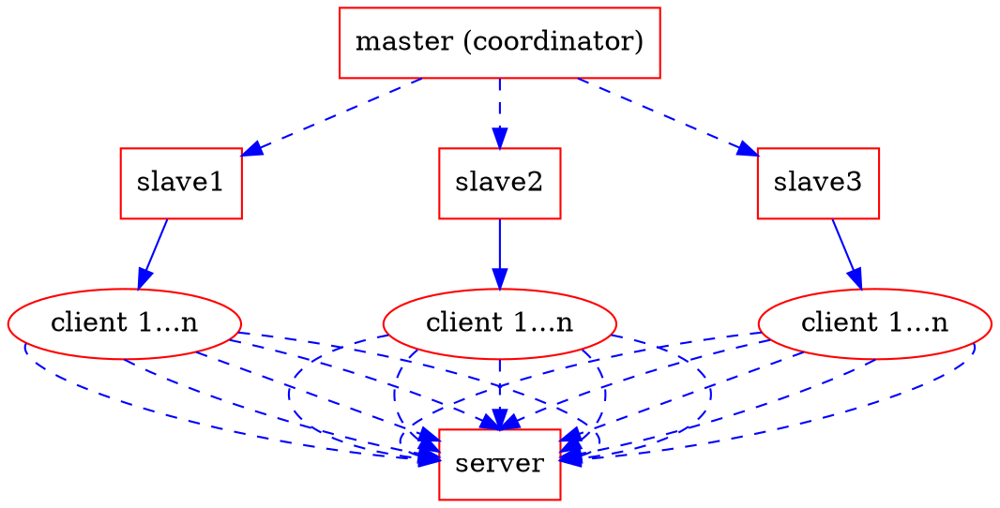
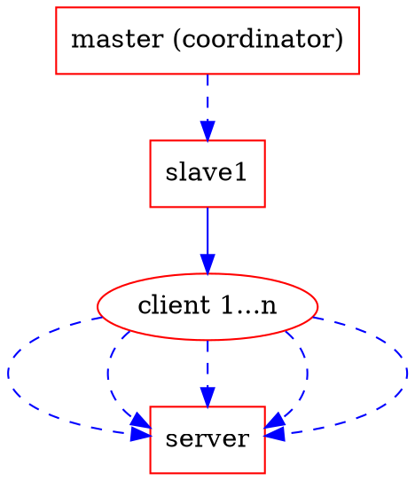
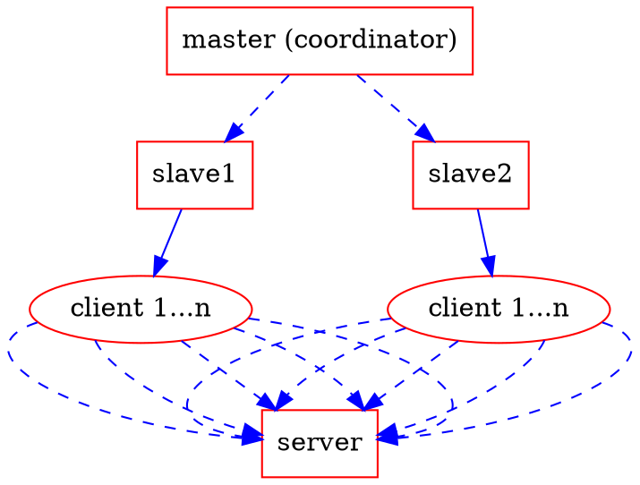

Locust to Go, Kubernetes to Load
===

<!-- .slide: data-background="pink" -->
<!-- .slide: data-transition="zoom" -->

"Go" to "load" test :dizzy:

> [name=郭學聰 Hsueh-Tsung Kuo] [time=Sat, 11 Aug 2018] [color=red]

---

<!-- .slide: data-transition="convex" -->

## who am I?


----

<!-- .slide: data-transition="convex" -->

* programmer from Rayark, a game company in Taiwan
* backend engineer, focus on common service
* usually develop something related to my work in Python, Ruby, Golang, C#
* built almost entire VOEZ game server by myself only
* supported Sdorica backend development


---

<!-- .slide: data-transition="convex" -->

## outline

----

<!-- .slide: data-transition="convex" -->

4. Locust <- Python
    1. Locust?
    2. usage
5. Locust -> Go
    1. interoperability
    2. boomer
6. play http service
7. docker & Kubernetes
    1. docker
    2. Kubernetes

----

<!-- .slide: data-transition="convex" -->

8. live coding
9. conclusion
10. commercial
11. Q&A

---

<!-- .slide: data-transition="convex" -->

## Locust <- Python

----

<!-- .slide: data-transition="convex" -->

### Locust?

----

<!-- .slide: data-transition="convex" -->


----

<!-- .slide: data-transition="convex" -->

### Locust?

* official website: https://locust.io/
  * Define user behaviour with Python code, and swarm your system with millions of simultaneous users.

----

<!-- .slide: data-transition="convex" -->

#### framework



----

<!-- .slide: data-transition="convex" -->

#### why slave?

* one client vs Google Cloud load balancer
  * :x: client lose
    * connections limitation
    * file descriptors limitation
* many clients vs Google Cloud load balancer
  * :o: client may win
    * ==**大家一起上!**== <!-- .element: class="fragment" data-fragment-index="2" -->

----

<!-- .slide: data-transition="convex" -->

### usage

----

<!-- .slide: data-transition="convex" -->

#### install

```shell
pip install locustio
```

----

<!-- .slide: data-transition="convex" -->

run Locust distributed across multiple processes/machines

```shell
pip install pyzmq
```
<!-- .element: class="fragment" data-fragment-index="1" -->

----

<!-- .slide: data-transition="convex" -->

#### code (simple)

```python=
from locust import HttpLocust, TaskSet, task

class WebsiteTasks(TaskSet):
    def on_start(self):
        self.client.post("/login", {
            "username": "test_user",
            "password": ""
        })

    @task
    def index(self):
        self.client.get("/")

    @task
    def about(self):
        self.client.get("/about/")

class WebsiteUser(HttpLocust):
    task_set = WebsiteTasks
    min_wait = 5000
    max_wait = 15000
```

----

<!-- .slide: data-transition="convex" -->

#### code (assign weight)

```python=
from locust import HttpLocust, TaskSet, task

class WebsiteTasks(TaskSet):
    def on_start(self):
        self.client.post("/login", {
            "username": "test_user",
            "password": ""
        })

    @task(100)
    def index(self):
        self.client.get("/")

    @task(7)
    def about(self):
        self.client.get("/about/")

class WebsiteUser(HttpLocust):
    task_set = WebsiteTasks
    min_wait = 5000
    max_wait = 15000
```

----

<!-- .slide: data-transition="convex" -->

#### build & run

```shell
locust -f locustfile.py --host=http://example.com
```

----

<!-- .slide: data-transition="convex" -->

#### monitoring


---

<!-- .slide: data-transition="convex" -->

## Locust -> Go

----

<!-- .slide: data-transition="convex" -->

### interoperability

* Python?
  * define tasks out of the box (standalone mode)
* foreign language?
  * ZeroMQ (master/slave mode) <!-- .element: class="fragment" data-fragment-index="1" -->

----

<!-- .slide: data-transition="convex" -->

```sequence
locust master->locust slave: ZeroMQ: make a request
note left of locust slave: log start time
locust slave->server: HTTP request
server->locust slave: HTTP response
note left of locust slave: log end time
note left of locust slave: detect response status
locust slave->locust master: ZeroMQ: report status
```

----

<!-- .slide: data-transition="convex" -->

#### why Go?

* fast <!-- .element: class="fragment" data-fragment-index="1" -->
* faster <!-- .element: class="fragment" data-fragment-index="2" -->
* fastest <!-- .element: class="fragment" data-fragment-index="3" -->

----

<!-- .slide: data-transition="convex" -->

#### why Go?

* server is written with Go
* client bots written with Python cannot be as fast as Go

----

<!-- .slide: data-transition="convex" -->

### boomer

* boomer: https://github.com/myzhan/boomer
  * Go module
  * load generator for Locust
  * be a slave
  * connect with Locust master via ZeroMQ
  * dependency:
    * https://github.com/zeromq/gomq

----

<!-- .slide: data-transition="convex" -->

#### code (simple)

`dummy.py`

```python=
# -*- coding: utf-8 -*-

from locust import Locust, TaskSet, task

class MyTaskSet(TaskSet):
    @task(20)
    def hello(self):
        pass

class Dummy(Locust):
    task_set = MyTaskSet
```

----

<!-- .slide: data-transition="convex" -->

`main.go`

```go=
package main

import "github.com/myzhan/boomer"
import "time"

func foo() {

    start := boomer.Now()
    time.Sleep(100 * time.Millisecond)
    elapsed := boomer.Now() - start

    // Report your test result as a success, if you write it in python, it will looks like this
    // events.request_success.fire(request_type="http", name="foo", response_time=100, response_length=10)
    boomer.Events.Publish("request_success", "http", "foo", elapsed, int64(10))
}
```

----

<!-- .slide: data-transition="convex" -->

`main.go`

```go=
func bar() {

    start := boomer.Now()
    time.Sleep(100 * time.Millisecond)
    elapsed := boomer.Now() - start

    // Report your test result as a failure, if you write it in python, it will looks like this
    // events.request_failure.fire(request_type="udp", name="bar", response_time=100, exception=Exception("udp error"))
    boomer.Events.Publish("request_failure", "udp", "bar", elapsed, "udp error")
}
```

----

<!-- .slide: data-transition="convex" -->

`main.go`

```go=
func main() {

    task1 := &boomer.Task{
        Name:   "foo",
        Weight: 10,
        Fn:     foo,
    }

    task2 := &boomer.Task{
        Name:   "bar",
        Weight: 20,
        Fn:     bar,
    }

    boomer.Run(task1, task2)

}
```

----

<!-- .slide: data-transition="convex" -->

#### finite state machine

* randomized
  * finance
  * social network
  * \.\.\.\.\.\. etc
* ordered
  * game

----

<!-- .slide: data-transition="convex" -->

#### code (finite state machine)

`main_seq.go`

```go=
package main


import "github.com/myzhan/boomer"
import "time"


func foobar(){

    start := boomer.Now()
    time.Sleep(100 * time.Millisecond)
    elapsed := boomer.Now() - start

    // Report your test result as a success, if you write it in python, it will looks like this
    // events.request_success.fire(request_type="http", name="foo", response_time=100, response_length=10)
    boomer.Events.Publish("request_success", "http", "foo", elapsed, int64(10))

    start = boomer.Now()
    time.Sleep(100 * time.Millisecond)
    elapsed = boomer.Now() - start

    // Report your test result as a failure, if you write it in python, it will looks like this
    // events.request_failure.fire(request_type="udp", name="bar", response_time=100, exception=Exception("udp error"))
    boomer.Events.Publish("request_failure", "udp", "bar", elapsed, "udp error")
}
```

----

<!-- .slide: data-transition="convex" -->

`main_seq.go`

```go=
func main(){

    sequencialTask1 := &boomer.Task{
        Name:   "foobar1",
        Weight: 10,
        Fn:     foobar,
    }

    sequencialTask2 := &boomer.Task{
        Name:   "foobar2",
        Weight: 20,
        Fn:     foobar,
    }

    boomer.Run(sequencialTask1, sequencialTask2)

}
```

----

<!-- .slide: data-transition="convex" -->

#### run as stand alone process (for debug)

```shell
go build -o a.out main.go
./a.out --run-tasks foo,bar
```

----

<!-- .slide: data-transition="convex" -->

#### run as slave mode

```shell
locust -f dummy.py --master --master-bind-host=127.0.0.1 --master-bind-port=5557
go build -o a.out main.go
./a.out --master-host=127.0.0.1 --master-port=5557 --rpc=zeromq
```

---

<!-- .slide: data-transition="convex" -->

## play http service

----

<!-- .slide: data-transition="convex" -->

```go=
resp, err := http.Get("http://example.com/")
...
resp, err := http.Post("http://example.com/upload", "image/jpeg", &buf)
...
resp, err := http.PostForm("http://example.com/form",
    url.Values{"key": {"Value"}, "id": {"123"}})
```

----

<!-- .slide: data-transition="convex" -->

```go=
func exampleGet() {
    start := boomer.Now()
    resp, err := http.Get("https://dl.google.com/go/go1.10.3.src.tar.gz")
    //resp, err := http.Get("https://cache.ruby-lang.org/pub/ruby/2.5/ruby-2.5.1.tar.gz")
    if err == nil {
        func() {
            defer resp.Body.Close()
            _, err = ioutil.ReadAll(resp.Body)
        }()
    }
    elapsed := boomer.Now() - start

    if err == nil {
        boomer.Events.Publish("request_success", "http", "example_get", elapsed, resp.ContentLength)
    } else {
        boomer.Events.Publish("request_failure", "http", "example_get", elapsed, err.Error())
    }
}
```

---

<!-- .slide: data-transition="convex" -->

## docker & Kubernetes

----

<!-- .slide: data-transition="convex" -->

### docker

----

<!-- .slide: data-transition="convex" -->

### docker

* multiple machine
  * break connections limitation
  * break file descriptors limitation
* multiple docker instance
  * break limitation
  * **easy scale** <!-- .element: class="fragment" data-fragment-index="1" -->

----

<!-- .slide: data-transition="convex" -->

### Kubernetes

----

<!-- .slide: data-transition="convex" -->

### Kubernetes

* ~~kill~~ control them all!!

----

<!-- .slide: data-transition="convex" -->

### Kubernetes


----

<!-- .slide: data-transition="convex" -->

#### kubectl scale --replicas=1 locust-slave



----

<!-- .slide: data-transition="convex" -->

#### kubectl scale --replicas=2 locust-slave



----

<!-- .slide: data-transition="convex" -->

#### kubectl scale --replicas=3 locust-slave


---

<!-- .slide: data-transition="convex" -->

## live coding

----

<!-- .slide: data-transition="convex" -->

never live coding
¯\\\_\(ツ\)\_/¯

----

<!-- .slide: data-transition="convex" -->

~~never~~ live coding
( O\_o) ?

----

<!-- .slide: data-transition="convex" -->

重新定義
"living" live coding
( @д@) !

----

<!-- .slide: data-transition="convex" -->

just do it
( >ω•)b

---

<!-- .slide: data-transition="convex" -->

## conclusion

----

<!-- .slide: data-transition="convex" -->

> :hash: "倒站即進化"
> [name=郭學聰 Hsueh-Tsung Kuo] [time=2018_08_11] [color=red]

----

<!-- .slide: data-transition="convex" -->

### special thanks

* backend: yuxioz, bluesky
* SRE: haraguroicha, hyww, mswu
* QA: xible
* others

---

<!-- .slide: data-transition="zoom" -->

## commercial

Sdorica -sunset-

* <small>OP Animation https://youtu.be/ktGRO8tCBqs</small>
* <small>Global Launch Trailer https://youtu.be/2aY7il7zuNk</small>
* <small>Background Story https://youtu.be/9tOmgueeY7I</small>

----

<!-- .slide: data-transition="zoom" -->



----

<!-- .slide: data-transition="zoom" -->

# Rayark Wants You !

Rayark Careers | Make A Difference

* EN https://careers.rayark.com/jobs/
* ZH https://careers.rayark.com/zh/jobs/

----

<!-- .slide: data-transition="zoom" -->

# Meet Rayark in COSCUP 攤位區

* 產品展示
* 精美小物

---

<!-- .slide: data-transition="zoom" -->

## Q&A

---

<style>
.reveal {
    background: #FFDFEF;
    color: black;
}
.reveal h2,
.reveal h3,
.reveal h4 {
    color: black;
}
.reveal code {
    font-size: 14px !important;
    line-height: 1.2;
}

.rightpart{
    float:right;
    width:50%;
}

.leftpart{
    margin-right: 50% !important;
    height:50%;
}
.reveal section img { background:none; border:none; box-shadow:none; }
p.blo {
	font-size: 50px !important;
	background:#B6BDBB;
	border:1px solid silver;
	display:inline-block;
	padding:0.5em 0.75em;
	border-radius: 10px;
	box-shadow: 5px 5px 5px #666;
}

p.blo1 {
	background: #c7c2bb;
}
p.blo2 {
	background: #b8c0c8;
}
p.blo3 {
	background: #c7cedd;
}

p.bloT {
	font-size: 60px !important;
	background:#B6BDD3;
	border:1px solid silver;
	display:inline-block;
	padding:0.5em 0.75em;
	border-radius: 8px;
	box-shadow: 1px 2px 5px #333;
}
p.bloA {
	background: #B6BDE3;
}
p.bloB {
	background: #E3BDB3;
}

.slide-number{
	margin-bottom:10px !important;
	width:100%;
	text-align:center;
	font-size:25px !important;
	background-color:transparent !important;
}
iframe.myclass{
	width:100px;
	height:100px;
	bottom:0;
	left:0;
	position:fixed;
	border:none;
	z-index:99999;
}
h1.raw {
	color: #fff;
	background-image: linear-gradient(90deg,#f35626,#feab3a);
	-webkit-background-clip: text;
	-webkit-text-fill-color: transparent;
	animation: hue 5s infinite linear;
}
@keyframes hue {
	from {
	  filter: hue-rotate(0deg);
	}
	to {
	  filter: hue-rotate(360deg);
	}
}
.progress{
height:14px !important;
}

.progress span{
height:14px !important;
background: url("data:image/png;base64,iVBORw0KGgoAAAANSUhEUgAAAAEAAAAMCAIAAAAs6UAAAAAAGXRFWHRTb2Z0d2FyZQBBZG9iZSBJbWFnZVJlYWR5ccllPAAAAyJpVFh0WE1MOmNvbS5hZG9iZS54bXAAAAAAADw/eHBhY2tldCBiZWdpbj0i77u/IiBpZD0iVzVNME1wQ2VoaUh6cmVTek5UY3prYzlkIj8+IDx4OnhtcG1ldGEgeG1sbnM6eD0iYWRvYmU6bnM6bWV0YS8iIHg6eG1wdGs9IkFkb2JlIFhNUCBDb3JlIDUuMy1jMDExIDY2LjE0NTY2MSwgMjAxMi8wMi8wNi0xNDo1NjoyNyAgICAgICAgIj4gPHJkZjpSREYgeG1sbnM6cmRmPSJodHRwOi8vd3d3LnczLm9yZy8xOTk5LzAyLzIyLXJkZi1zeW50YXgtbnMjIj4gPHJkZjpEZXNjcmlwdGlvbiByZGY6YWJvdXQ9IiIgeG1sbnM6eG1wPSJodHRwOi8vbnMuYWRvYmUuY29tL3hhcC8xLjAvIiB4bWxuczp4bXBNTT0iaHR0cDovL25zLmFkb2JlLmNvbS94YXAvMS4wL21tLyIgeG1sbnM6c3RSZWY9Imh0dHA6Ly9ucy5hZG9iZS5jb20veGFwLzEuMC9zVHlwZS9SZXNvdXJjZVJlZiMiIHhtcDpDcmVhdG9yVG9vbD0iQWRvYmUgUGhvdG9zaG9wIENTNiAoV2luZG93cykiIHhtcE1NOkluc3RhbmNlSUQ9InhtcC5paWQ6QUNCQzIyREQ0QjdEMTFFMzlEMDM4Qzc3MEY0NzdGMDgiIHhtcE1NOkRvY3VtZW50SUQ9InhtcC5kaWQ6QUNCQzIyREU0QjdEMTFFMzlEMDM4Qzc3MEY0NzdGMDgiPiA8eG1wTU06RGVyaXZlZEZyb20gc3RSZWY6aW5zdGFuY2VJRD0ieG1wLmlpZDpBQ0JDMjJEQjRCN0QxMUUzOUQwMzhDNzcwRjQ3N0YwOCIgc3RSZWY6ZG9jdW1lbnRJRD0ieG1wLmRpZDpBQ0JDMjJEQzRCN0QxMUUzOUQwMzhDNzcwRjQ3N0YwOCIvPiA8L3JkZjpEZXNjcmlwdGlvbj4gPC9yZGY6UkRGPiA8L3g6eG1wbWV0YT4gPD94cGFja2V0IGVuZD0iciI/PovDFgYAAAAmSURBVHjaYvjPwMAAxjMZmBhA9H8INv4P4TPM/A+m04zBNECAAQBCWQv9SUQpVgAAAABJRU5ErkJggg==") repeat-x !important;

}

.progress span:after,
.progress span.nyancat{
	content: "";
	background: url('data:image/gif;base64,R0lGODlhIgAVAKIHAL3/9/+Zmf8zmf/MmZmZmf+Z/wAAAAAAACH/C05FVFNDQVBFMi4wAwEAAAAh/wtYTVAgRGF0YVhNUDw/eHBhY2tldCBiZWdpbj0i77u/IiBpZD0iVzVNME1wQ2VoaUh6cmVTek5UY3prYzlkIj8+IDx4OnhtcG1ldGEgeG1sbnM6eD0iYWRvYmU6bnM6bWV0YS8iIHg6eG1wdGs9IkFkb2JlIFhNUCBDb3JlIDUuMy1jMDExIDY2LjE0NTY2MSwgMjAxMi8wMi8wNi0xNDo1NjoyNyAgICAgICAgIj4gPHJkZjpSREYgeG1sbnM6cmRmPSJodHRwOi8vd3d3LnczLm9yZy8xOTk5LzAyLzIyLXJkZi1zeW50YXgtbnMjIj4gPHJkZjpEZXNjcmlwdGlvbiByZGY6YWJvdXQ9IiIgeG1sbnM6eG1wTU09Imh0dHA6Ly9ucy5hZG9iZS5jb20veGFwLzEuMC9tbS8iIHhtbG5zOnN0UmVmPSJodHRwOi8vbnMuYWRvYmUuY29tL3hhcC8xLjAvc1R5cGUvUmVzb3VyY2VSZWYjIiB4bWxuczp4bXA9Imh0dHA6Ly9ucy5hZG9iZS5jb20veGFwLzEuMC8iIHhtcE1NOk9yaWdpbmFsRG9jdW1lbnRJRD0ieG1wLmRpZDpDMkJBNjY5RTU1NEJFMzExOUM4QUM2MDAwNDQzRERBQyIgeG1wTU06RG9jdW1lbnRJRD0ieG1wLmRpZDpCREIzOEIzMzRCN0IxMUUzODhEQjgwOTYzMTgyNTE0QiIgeG1wTU06SW5zdGFuY2VJRD0ieG1wLmlpZDpCREIzOEIzMjRCN0IxMUUzODhEQjgwOTYzMTgyNTE0QiIgeG1wOkNyZWF0b3JUb29sPSJBZG9iZSBQaG90b3Nob3AgQ1M2IChXaW5kb3dzKSI+IDx4bXBNTTpEZXJpdmVkRnJvbSBzdFJlZjppbnN0YW5jZUlEPSJ4bXAuaWlkOkM1QkE2NjlFNTU0QkUzMTE5QzhBQzYwMDA0NDNEREFDIiBzdFJlZjpkb2N1bWVudElEPSJ4bXAuZGlkOkMyQkE2NjlFNTU0QkUzMTE5QzhBQzYwMDA0NDNEREFDIi8+IDwvcmRmOkRlc2NyaXB0aW9uPiA8L3JkZjpSREY+IDwveDp4bXBtZXRhPiA8P3hwYWNrZXQgZW5kPSJyIj8+Af/+/fz7+vn49/b19PPy8fDv7u3s6+rp6Ofm5eTj4uHg397d3Nva2djX1tXU09LR0M/OzczLysnIx8bFxMPCwcC/vr28u7q5uLe2tbSzsrGwr66trKuqqainpqWko6KhoJ+enZybmpmYl5aVlJOSkZCPjo2Mi4qJiIeGhYSDgoGAf359fHt6eXh3dnV0c3JxcG9ubWxramloZ2ZlZGNiYWBfXl1cW1pZWFdWVVRTUlFQT05NTEtKSUhHRkVEQ0JBQD8+PTw7Ojk4NzY1NDMyMTAvLi0sKyopKCcmJSQjIiEgHx4dHBsaGRgXFhUUExIREA8ODQwLCgkIBwYFBAMCAQAAIfkECQcABwAsAAAAACIAFQAAA6J4umv+MDpG6zEj682zsRaWFWRpltoHMuJZCCRseis7xG5eDGp93bqCA7f7TFaYoIFAMMwczB5EkTzJllEUttmIGoG5bfPBjDawD7CsJC67uWcv2CRov929C/q2ZpcBbYBmLGk6W1BRY4MUDnMvJEsBAXdlknk2fCeRk2iJliAijpBlEmigjR0plKSgpKWvEUheF4tUZqZID1RHjEe8PsDBBwkAIfkECQcABwAsAAAAACIAFQAAA6B4umv+MDpG6zEj682zsRaWFWRpltoHMuJZCCRseis7xG5eDGp93TqS40XiKSYgTLBgIBAMqE/zmQSaZEzns+jQ9pC/5dQJ0VIv5KMVWxqb36opxHrNvu9ptPfGbmsBbgSAeRdydCdjXWRPchQPh1hNAQF4TpM9NnwukpRyi5chGjqJEoSOIh0plaYsZBKvsCuNjY5ptElgDyFIuj6+vwcJACH5BAkHAAcALAAAAAAiABUAAAOfeLrc/vCZSaudUY7Nu99GxhhcYZ7oyYXiQQ5pIZgzCrYuLMd8MbAiUu802flYGIhwaCAQDKpQ86nUoWqF6dP00wIby572SXE6vyMrlmhuu9GKifWaddvNQAtszXYCxgR/Zy5jYTFeXmSDiIZGdQEBd06QSBQ5e4cEkE9nnZQaG2J4F4MSLx8rkqUSZBeurhlTUqsLsi60DpZxSWBJugcJACH5BAkHAAcALAAAAAAiABUAAAOgeLrc/vCZSaudUY7Nu99GxhhcYZ7oyYXiQQ5pIZgzCrYuLMd8MbAiUu802flYGIhwaCAQDKpQ86nUoWqF6dP00wIby572SXE6vyMrlmhuu9GuifWaddvNwMkZtmY7AWMEgGcKY2ExXl5khFMVc0Z1AQF3TpJShDl8iASST2efloV5JTyJFpgOch8dgW9KZxexshGNLqgLtbW0SXFwvaJfCQAh+QQJBwAHACwAAAAAIgAVAAADoXi63P7wmUmrnVGOzbvfRsYYXGGe6MmF4kEOaSGYMwq2LizHfDGwIlLPNKGZfi6gZmggEAy2iVPZEKZqzakq+1xUFFYe90lxTsHmim6HGpvf3eR7skYJ3PC5tyystc0AboFnVXQ9XFJTZIQOYUYFTQEBeWaSVF4bbCeRk1meBJYSL3WbaReMIxQfHXh6jaYXsbEQni6oaF21ERR7l0ksvA0JACH5BAkHAAcALAAAAAAiABUAAAOeeLrc/vCZSaudUY7Nu99GxhhcYZ7oyYXiQQ5pIZgzCrYuLMfFlA4hTITEMxkIBMOuADwmhzqeM6mashTCXKw2TVKQyKuTRSx2wegnNkyJ1ozpOFiMLqcEU8BZHx6NYW8nVlZefQ1tZgQBAXJIi1eHUTRwi0lhl48QL0sogxaGDhMlUo2gh14fHhcVmnOrrxNqrU9joX21Q0IUElm7DQkAIfkECQcABwAsAAAAACIAFQAAA6J4umv+MDpG6zEj682zsRaWFWRpltoHMuJZCCRseis7xG5eDGp93bqCA7f7TFaYoIFAMMwczB5EkTzJllEUttmIGoG5bfPBjDawD7CsJC67uWcv2CRov929C/q2ZpcBbYBmLGk6W1BRY4MUDnMvJEsBAXdlknk2fCeRk2iJliAijpBlEmigjR0plKSgpKWvEUheF4tUZqZID1RHjEe8PsDBBwkAIfkECQcABwAsAAAAACIAFQAAA6B4umv+MDpG6zEj682zsRaWFWRpltoHMuJZCCRseis7xG5eDGp93TqS40XiKSYgTLBgIBAMqE/zmQSaZEzns+jQ9pC/5dQJ0VIv5KMVWxqb36opxHrNvu9ptPfGbmsBbgSAeRdydCdjXWRPchQPh1hNAQF4TpM9NnwukpRyi5chGjqJEoSOIh0plaYsZBKvsCuNjY5ptElgDyFIuj6+vwcJACH5BAkHAAcALAAAAAAiABUAAAOfeLrc/vCZSaudUY7Nu99GxhhcYZ7oyYXiQQ5pIZgzCrYuLMd8MbAiUu802flYGIhwaCAQDKpQ86nUoWqF6dP00wIby572SXE6vyMrlmhuu9GKifWaddvNQAtszXYCxgR/Zy5jYTFeXmSDiIZGdQEBd06QSBQ5e4cEkE9nnZQaG2J4F4MSLx8rkqUSZBeurhlTUqsLsi60DpZxSWBJugcJACH5BAkHAAcALAAAAAAiABUAAAOgeLrc/vCZSaudUY7Nu99GxhhcYZ7oyYXiQQ5pIZgzCrYuLMd8MbAiUu802flYGIhwaCAQDKpQ86nUoWqF6dP00wIby572SXE6vyMrlmhuu9GuifWaddvNwMkZtmY7AWMEgGcKY2ExXl5khFMVc0Z1AQF3TpJShDl8iASST2efloV5JTyJFpgOch8dgW9KZxexshGNLqgLtbW0SXFwvaJfCQAh+QQJBwAHACwAAAAAIgAVAAADoXi63P7wmUmrnVGOzbvfRsYYXGGe6MmF4kEOaSGYMwq2LizHfDGwIlLPNKGZfi6gZmggEAy2iVPZEKZqzakq+1xUFFYe90lxTsHmim6HGpvf3eR7skYJ3PC5tyystc0AboFnVXQ9XFJTZIQOYUYFTQEBeWaSVF4bbCeRk1meBJYSL3WbaReMIxQfHXh6jaYXsbEQni6oaF21ERR7l0ksvA0JACH5BAkHAAcALAAAAAAiABUAAAOeeLrc/vCZSaudUY7Nu99GxhhcYZ7oyYXiQQ5pIZgzCrYuLMfFlA4hTITEMxkIBMOuADwmhzqeM6mashTCXKw2TVKQyKuTRSx2wegnNkyJ1ozpOFiMLqcEU8BZHx6NYW8nVlZefQ1tZgQBAXJIi1eHUTRwi0lhl48QL0sogxaGDhMlUo2gh14fHhcVmnOrrxNqrU9joX21Q0IUElm7DQkAOw==') !important;
   width: 34px !important;
   height: 21px !important;
   border: none !important;
   float:right;
   margin-top:-7px;
   margin-right:-10px;
}
</style>

