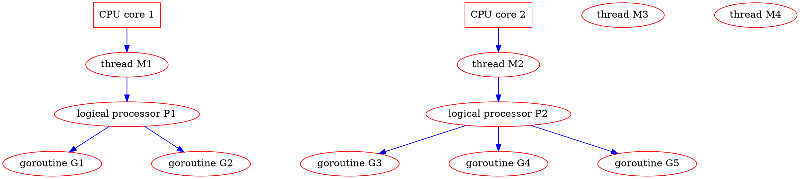
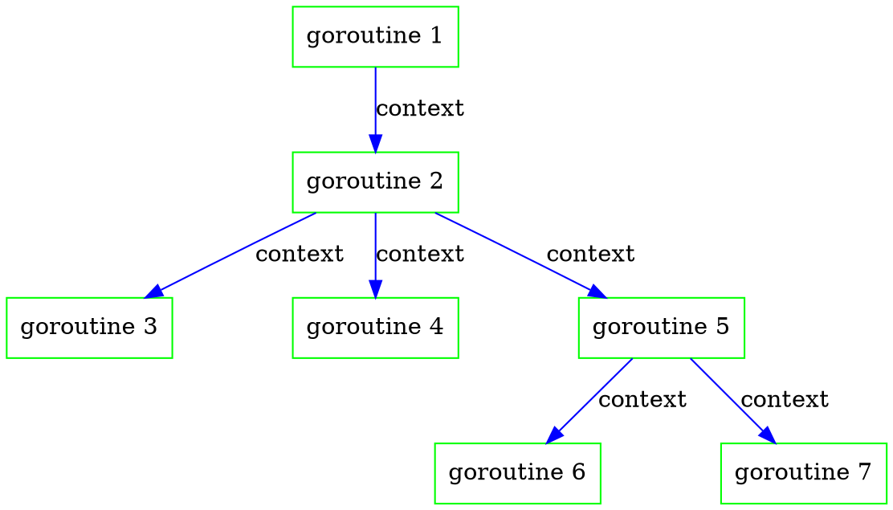
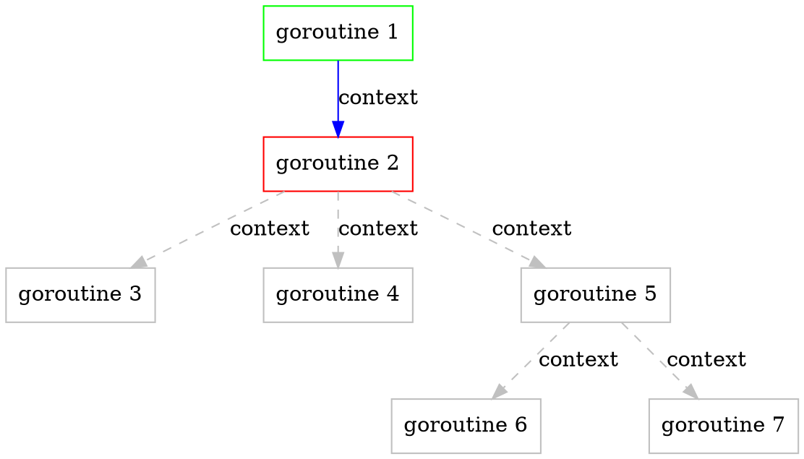

something you don’t know about
Golang context
===

<!-- .slide: data-background="pink" -->
<!-- .slide: data-transition="zoom" -->

> :hash: object vs context
>
> [name=郭學聰 Hsueh-Tsung Kuo] [time=Sun, 18 Aug 2019] [color=red]

---

<!-- .slide: data-transition="convex" -->

## who am I?


----

<!-- .slide: data-transition="convex" -->

* programmer from Rayark, a game company in Taiwan
* backend (and temporary frontend) engineer, focus on common service
* usually develop something related to my work in Python, Ruby, ECMAScript, Golang, C#
* ECMAScript hater since **Netscape** is dead
* built CDN-aware game asset update system
* built almost entire VOEZ game server by myself only
* supported Sdorica backend development

---

<!-- .slide: data-transition="convex" -->

## outline

ʕ◔ϖ◔ʔ

----

<!-- .slide: data-transition="convex" -->

4. process/thread/fiber
    * process
    * thread
    * fiber
5. goroutine
    * M:N threading
6. control process/thread/fiber/goroutine
    * id
    * object
    * context

----

<!-- .slide: data-transition="convex" -->

7. context
    * map (goroutine scope variable)
    * control
8. issues
    * join
9. conclusion
    * principle
    * comment
    * reference
10. commercial
11. Q&A

---

<!-- .slide: data-transition="convex" -->

## process/thread/fiber

----

<!-- .slide: data-transition="convex" -->

### common

* independent program counter
* independent stack

----

<!-- .slide: data-transition="convex" -->

### process

* independent user memory space
* almost preemptive multitasking
  * exclude classic MacOS ~9 & Windows ~3.x
* could run in parallel on different CPU core

----

<!-- .slide: data-transition="convex" -->

### thread

* shared memory space
* may be preemptive or cooperative multitasking
* could run in parallel on different CPU core

----

<!-- .slide: data-transition="convex" -->

### fiber

* shared memory space
* cooperative multitasking
* yield (context switch) manually

---

<!-- .slide: data-transition="convex" -->

## goroutine

----

<!-- .slide: data-transition="convex" -->

### goroutine?

* M:N threading
  * G-P-M model

----

<!-- .slide: data-transition="convex" -->

### M:N threading



---

<!-- .slide: data-transition="convex" -->

## control process/thread/fiber/goroutine

----

<!-- .slide: data-transition="convex" -->

how to trace process/thread/fiber?

* id
* object

----

<!-- .slide: data-transition="convex" -->

### id

* POSIX
  * pid = fork();
  * pthread_create(pthread_t *thread, ...);
    * typedef unsigned long int pthread_t;
* Windows
  * pid = spawn(P_NOWAIT, ...);

----

<!-- .slide: data-transition="convex" -->

### object

Ruby
```ruby=
t = Thread.new {
    (1..5).each {
        puts('hello')
        sleep(1.0)
    }
}
t.terminate()
t.join()
```

C#
```clike=
Thread t = new Thread(new ThreadStart(object.Method));
t.Start();
t.Abort();
t.Join();
```

----

<!-- .slide: data-transition="convex" -->

### goroutine

* Go
  * start?
    * go function() <!-- .element: class="fragment" data-fragment-index="1" -->
  * terminate? join?
    * use the channels, Luke! <!-- .element: class="fragment" data-fragment-index="2" -->

----

<!-- .slide: data-transition="convex" -->

communicating sequential processes newbie:
manually assign channels for every goroutine!?

----

<!-- .slide: data-transition="convex" -->

### somehow idiomatic solution

```go=
import "context"

parentCtx := context.Background()
childCtx, cancel := context.WithCancel(parentCtx)

go function(ctx context.Context, param1 int, param2 string) error {
    for {
        select {
        case <-ctx.Done():
            return ctx.Err()
        default:
            doSomething()
        }
    }
}(childCtx, param1, param2)

cancel()
```

----

<!-- .slide: data-transition="convex" -->



----

<!-- .slide: data-transition="convex" -->



----

<!-- .slide: data-transition="convex" -->

that is all?

----

<!-- .slide: data-transition="convex" -->


<small>https://store.line.me/stickershop/product/8601/zh-Hant</small>

---

<!-- .slide: data-transition="convex" -->

## context

----

<!-- .slide: data-transition="convex" -->

### context?

* map (goroutine scope variable)
* control

----

<!-- .slide: data-transition="convex" -->

```go=
// init
parentCtx := context.Background()

// map (goroutine scope variable)
// store goroutine scope variable
childCtx := context.WithValue(parentCtx, key, value)
value, ok := childCtx.Value(key).(ValueType)

// control
// get cancel button
childCtx, cancel := context.WithCancel(parentCtx)
// get cancel button and set deadline
childCtx, cancel := context.WithDeadline(parentCtx, deadline)
// get cancel button and set timeout
childCtx, cancel := context.WithTimeout(parentCtx, timeout)
```

every context.With*() string context as linked list <!-- .element: class="fragment" data-fragment-index="1" -->

----

<!-- .slide: data-transition="convex" -->

### map (goroutine scope variable)

----

<!-- .slide: data-transition="convex" -->

```go=
childCtx := context.WithValue(parentCtx, key, value)
value, ok := childCtx.Value(key).(ValueType)
```

----

<!-- .slide: data-transition="convex" -->

warning :warning:

```
The provided key must be comparable and should not be of type string or any other built-in type to avoid
collisions between packages using context. Users of WithValue should define their own types for keys. To avoid
allocating when assigning to an interface{}, context keys often have concrete type struct{}. Alternatively, exported
context key variables' static type should be a pointer or interface.
```

<small>https://golang.org/pkg/context/</small>

----

<!-- .slide: data-transition="convex" -->

warning :warning:

```go=
type contextKey int

const (
    contextKeySessionData = contextKey(1)
)

contextWithSessionData := context.WithValue(r.Context(), contextKeySessionData, sessionData)

sessionData, ok := r.Context().Value(contextKeySessionData).(*AuthSessionData)
```

<small>https://github.com/rayark/osecure/blob/master/osecure.go</small>

----

<!-- .slide: data-transition="convex" -->

### control

----

<!-- .slide: data-transition="convex" -->

```go=
// get cancel button
childCtx, cancel := context.WithCancel(parentCtx)
```

----

<!-- .slide: data-transition="convex" -->

```go=
// get cancel button and set deadline
childCtx, cancel := context.WithDeadline(parentCtx, deadline)
```

----

<!-- .slide: data-transition="convex" -->

```go=
// get cancel button and set timeout
childCtx, cancel := context.WithTimeout(parentCtx, timeout)
```

---

<!-- .slide: data-transition="convex" -->

## issues

----

<!-- .slide: data-transition="convex" -->

### start/terminate/join

* start
  * go function()
* terminate
  * childCtx, cancel := context.WithCancel(parentCtx) <!-- .element: class="fragment" data-fragment-index="1" -->
  * cancel() <!-- .element: class="fragment" data-fragment-index="2" -->
* join
  * context: this is not on my business <!-- .element: class="fragment" data-fragment-index="3" -->

----

<!-- .slide: data-transition="convex" -->

[大事不妙啊] ʕOϖOʔ


<small>https://dic.nicovideo.jp/a/マジやばくね</small>

----

<!-- .slide: data-transition="convex" -->

### join

```go=
import "sync"

var wg sync.WaitGroup

wg.Add(1)

go function() {
    defer wg.Done()
    doSomething()
}()

wg.Wait()
```

----

<!-- .slide: data-transition="convex" -->

### the elegant(?) solution

```sequence
note left of parent: wg.Add()
parent->child: go function()
note right of child: start
parent->child: cancel()
note right of child: case <-ctx.Done():
note right of child: stop
parent->child: call wg.Wait()
note right of child: wg.Done()
child->parent: wg.Wait() return
```

----

<!-- .slide: data-transition="convex" -->

note :notebook:
* we can replace all of them with channels

----

<!-- .slide: data-transition="zoom" -->

this is it
( >ω•)b

----

<!-- .slide: data-transition="zoom" -->

~~this is it~~
( O\_o) ?

----

<!-- .slide: data-transition="zoom" -->

what about deeply nested goroutine?
( @д@) !

----

<!-- .slide: data-transition="zoom" -->

forget it
¯\\\_\(ツ\)\_/¯

----

<!-- .slide: data-transition="convex" -->

or more elegant way:

* Package tomb
  * https://gopkg.in/tomb.v2

---

<!-- .slide: data-transition="convex" -->

## conclusion

----

<!-- .slide: data-transition="convex" -->

context =
(thread object) - (join) + (thread scope variable)

> [name=郭學聰 Hsueh-Tsung Kuo] [time=2019_08_18] [color=red]

----

<!-- .slide: data-transition="convex" -->

### principle

```
Incoming requests to a server should create a Context,
and outgoing calls to servers should accept a Context.
```

<small>https://golang.org/pkg/context/</small>

----

<!-- .slide: data-transition="convex" -->

elegant :dizzy:

```go=
func HandlerFunc(w http.ResponseWriter, r *http.Request) {
    ctx := r.Context()
    resource.Connect(ctx, param1, param2)
    ...
}
```

----

<!-- .slide: data-transition="convex" -->

### comment

* comment on context
  * community
    * good/bad design = the **con**current war
  * me
    * not perfect, but **practical**

----

<!-- .slide: data-transition="convex" -->

### reference

* Go Package context
  * <small>https://golang.org/pkg/context/</small>
* Package tomb
  * <small>https://gopkg.in/tomb.v2</small>
* Context isn’t for cancellation - Dave Cheney
  * <small>https://dave.cheney.net/2017/08/20/context-isnt-for-cancellation</small>
* Context should go away for Go 2 - Michal Štrba
  * <small>https://faiface.github.io/post/context-should-go-away-go2/</small>

---

<!-- .slide: data-transition="zoom" -->

## commercial

----

<!-- .slide: data-transition="zoom" -->

Sdorica -mirage-

* <small>OP Animation https://www.youtube.com/watch?v=ggrrxYZT5yU</small>

----

<!-- .slide: data-transition="zoom" -->



----

<!-- .slide: data-transition="zoom" -->

# Rayark Wants You !

Rayark Careers | Make A Difference

* EN https://careers.rayark.com/jobs/
* ZH https://careers.rayark.com/zh/jobs/

---

<!-- .slide: data-transition="zoom" -->

## Q&A

---

<style>
.reveal {
    background: #FFDFEF;
    color: black;
}
.reveal h2,
.reveal h3,
.reveal h4 {
    color: black;
}
.reveal code {
    font-size: 18px !important;
    line-height: 1.2;
}

.rightpart{
    float:right;
    width:50%;
}

.leftpart{
    margin-right: 50% !important;
    height:50%;
}
.reveal section img { background:none; border:none; box-shadow:none; }
p.blo {
	font-size: 50px !important;
	background:#B6BDBB;
	border:1px solid silver;
	display:inline-block;
	padding:0.5em 0.75em;
	border-radius: 10px;
	box-shadow: 5px 5px 5px #666;
}

p.blo1 {
	background: #c7c2bb;
}
p.blo2 {
	background: #b8c0c8;
}
p.blo3 {
	background: #c7cedd;
}

p.bloT {
	font-size: 60px !important;
	background:#B6BDD3;
	border:1px solid silver;
	display:inline-block;
	padding:0.5em 0.75em;
	border-radius: 8px;
	box-shadow: 1px 2px 5px #333;
}
p.bloA {
	background: #B6BDE3;
}
p.bloB {
	background: #E3BDB3;
}

.slide-number{
	margin-bottom:10px !important;
	width:100%;
	text-align:center;
	font-size:25px !important;
	background-color:transparent !important;
}
iframe.myclass{
	width:100px;
	height:100px;
	bottom:0;
	left:0;
	position:fixed;
	border:none;
	z-index:99999;
}
h1.raw {
	color: #fff;
	background-image: linear-gradient(90deg,#f35626,#feab3a);
	-webkit-background-clip: text;
	-webkit-text-fill-color: transparent;
	animation: hue 5s infinite linear;
}
@keyframes hue {
	from {
	  filter: hue-rotate(0deg);
	}
	to {
	  filter: hue-rotate(360deg);
	}
}
.progress{
height:14px !important;
}

.progress span{
height:14px !important;
background: url("data:image/png;base64,iVBORw0KGgoAAAANSUhEUgAAAAEAAAAMCAIAAAAs6UAAAAAAGXRFWHRTb2Z0d2FyZQBBZG9iZSBJbWFnZVJlYWR5ccllPAAAAyJpVFh0WE1MOmNvbS5hZG9iZS54bXAAAAAAADw/eHBhY2tldCBiZWdpbj0i77u/IiBpZD0iVzVNME1wQ2VoaUh6cmVTek5UY3prYzlkIj8+IDx4OnhtcG1ldGEgeG1sbnM6eD0iYWRvYmU6bnM6bWV0YS8iIHg6eG1wdGs9IkFkb2JlIFhNUCBDb3JlIDUuMy1jMDExIDY2LjE0NTY2MSwgMjAxMi8wMi8wNi0xNDo1NjoyNyAgICAgICAgIj4gPHJkZjpSREYgeG1sbnM6cmRmPSJodHRwOi8vd3d3LnczLm9yZy8xOTk5LzAyLzIyLXJkZi1zeW50YXgtbnMjIj4gPHJkZjpEZXNjcmlwdGlvbiByZGY6YWJvdXQ9IiIgeG1sbnM6eG1wPSJodHRwOi8vbnMuYWRvYmUuY29tL3hhcC8xLjAvIiB4bWxuczp4bXBNTT0iaHR0cDovL25zLmFkb2JlLmNvbS94YXAvMS4wL21tLyIgeG1sbnM6c3RSZWY9Imh0dHA6Ly9ucy5hZG9iZS5jb20veGFwLzEuMC9zVHlwZS9SZXNvdXJjZVJlZiMiIHhtcDpDcmVhdG9yVG9vbD0iQWRvYmUgUGhvdG9zaG9wIENTNiAoV2luZG93cykiIHhtcE1NOkluc3RhbmNlSUQ9InhtcC5paWQ6QUNCQzIyREQ0QjdEMTFFMzlEMDM4Qzc3MEY0NzdGMDgiIHhtcE1NOkRvY3VtZW50SUQ9InhtcC5kaWQ6QUNCQzIyREU0QjdEMTFFMzlEMDM4Qzc3MEY0NzdGMDgiPiA8eG1wTU06RGVyaXZlZEZyb20gc3RSZWY6aW5zdGFuY2VJRD0ieG1wLmlpZDpBQ0JDMjJEQjRCN0QxMUUzOUQwMzhDNzcwRjQ3N0YwOCIgc3RSZWY6ZG9jdW1lbnRJRD0ieG1wLmRpZDpBQ0JDMjJEQzRCN0QxMUUzOUQwMzhDNzcwRjQ3N0YwOCIvPiA8L3JkZjpEZXNjcmlwdGlvbj4gPC9yZGY6UkRGPiA8L3g6eG1wbWV0YT4gPD94cGFja2V0IGVuZD0iciI/PovDFgYAAAAmSURBVHjaYvjPwMAAxjMZmBhA9H8INv4P4TPM/A+m04zBNECAAQBCWQv9SUQpVgAAAABJRU5ErkJggg==") repeat-x !important;

}

.progress span:after,
.progress span.nyancat{
	content: "";
	background: url('data:image/gif;base64,R0lGODlhIgAVAKIHAL3/9/+Zmf8zmf/MmZmZmf+Z/wAAAAAAACH/C05FVFNDQVBFMi4wAwEAAAAh/wtYTVAgRGF0YVhNUDw/eHBhY2tldCBiZWdpbj0i77u/IiBpZD0iVzVNME1wQ2VoaUh6cmVTek5UY3prYzlkIj8+IDx4OnhtcG1ldGEgeG1sbnM6eD0iYWRvYmU6bnM6bWV0YS8iIHg6eG1wdGs9IkFkb2JlIFhNUCBDb3JlIDUuMy1jMDExIDY2LjE0NTY2MSwgMjAxMi8wMi8wNi0xNDo1NjoyNyAgICAgICAgIj4gPHJkZjpSREYgeG1sbnM6cmRmPSJodHRwOi8vd3d3LnczLm9yZy8xOTk5LzAyLzIyLXJkZi1zeW50YXgtbnMjIj4gPHJkZjpEZXNjcmlwdGlvbiByZGY6YWJvdXQ9IiIgeG1sbnM6eG1wTU09Imh0dHA6Ly9ucy5hZG9iZS5jb20veGFwLzEuMC9tbS8iIHhtbG5zOnN0UmVmPSJodHRwOi8vbnMuYWRvYmUuY29tL3hhcC8xLjAvc1R5cGUvUmVzb3VyY2VSZWYjIiB4bWxuczp4bXA9Imh0dHA6Ly9ucy5hZG9iZS5jb20veGFwLzEuMC8iIHhtcE1NOk9yaWdpbmFsRG9jdW1lbnRJRD0ieG1wLmRpZDpDMkJBNjY5RTU1NEJFMzExOUM4QUM2MDAwNDQzRERBQyIgeG1wTU06RG9jdW1lbnRJRD0ieG1wLmRpZDpCREIzOEIzMzRCN0IxMUUzODhEQjgwOTYzMTgyNTE0QiIgeG1wTU06SW5zdGFuY2VJRD0ieG1wLmlpZDpCREIzOEIzMjRCN0IxMUUzODhEQjgwOTYzMTgyNTE0QiIgeG1wOkNyZWF0b3JUb29sPSJBZG9iZSBQaG90b3Nob3AgQ1M2IChXaW5kb3dzKSI+IDx4bXBNTTpEZXJpdmVkRnJvbSBzdFJlZjppbnN0YW5jZUlEPSJ4bXAuaWlkOkM1QkE2NjlFNTU0QkUzMTE5QzhBQzYwMDA0NDNEREFDIiBzdFJlZjpkb2N1bWVudElEPSJ4bXAuZGlkOkMyQkE2NjlFNTU0QkUzMTE5QzhBQzYwMDA0NDNEREFDIi8+IDwvcmRmOkRlc2NyaXB0aW9uPiA8L3JkZjpSREY+IDwveDp4bXBtZXRhPiA8P3hwYWNrZXQgZW5kPSJyIj8+Af/+/fz7+vn49/b19PPy8fDv7u3s6+rp6Ofm5eTj4uHg397d3Nva2djX1tXU09LR0M/OzczLysnIx8bFxMPCwcC/vr28u7q5uLe2tbSzsrGwr66trKuqqainpqWko6KhoJ+enZybmpmYl5aVlJOSkZCPjo2Mi4qJiIeGhYSDgoGAf359fHt6eXh3dnV0c3JxcG9ubWxramloZ2ZlZGNiYWBfXl1cW1pZWFdWVVRTUlFQT05NTEtKSUhHRkVEQ0JBQD8+PTw7Ojk4NzY1NDMyMTAvLi0sKyopKCcmJSQjIiEgHx4dHBsaGRgXFhUUExIREA8ODQwLCgkIBwYFBAMCAQAAIfkECQcABwAsAAAAACIAFQAAA6J4umv+MDpG6zEj682zsRaWFWRpltoHMuJZCCRseis7xG5eDGp93bqCA7f7TFaYoIFAMMwczB5EkTzJllEUttmIGoG5bfPBjDawD7CsJC67uWcv2CRov929C/q2ZpcBbYBmLGk6W1BRY4MUDnMvJEsBAXdlknk2fCeRk2iJliAijpBlEmigjR0plKSgpKWvEUheF4tUZqZID1RHjEe8PsDBBwkAIfkECQcABwAsAAAAACIAFQAAA6B4umv+MDpG6zEj682zsRaWFWRpltoHMuJZCCRseis7xG5eDGp93TqS40XiKSYgTLBgIBAMqE/zmQSaZEzns+jQ9pC/5dQJ0VIv5KMVWxqb36opxHrNvu9ptPfGbmsBbgSAeRdydCdjXWRPchQPh1hNAQF4TpM9NnwukpRyi5chGjqJEoSOIh0plaYsZBKvsCuNjY5ptElgDyFIuj6+vwcJACH5BAkHAAcALAAAAAAiABUAAAOfeLrc/vCZSaudUY7Nu99GxhhcYZ7oyYXiQQ5pIZgzCrYuLMd8MbAiUu802flYGIhwaCAQDKpQ86nUoWqF6dP00wIby572SXE6vyMrlmhuu9GKifWaddvNQAtszXYCxgR/Zy5jYTFeXmSDiIZGdQEBd06QSBQ5e4cEkE9nnZQaG2J4F4MSLx8rkqUSZBeurhlTUqsLsi60DpZxSWBJugcJACH5BAkHAAcALAAAAAAiABUAAAOgeLrc/vCZSaudUY7Nu99GxhhcYZ7oyYXiQQ5pIZgzCrYuLMd8MbAiUu802flYGIhwaCAQDKpQ86nUoWqF6dP00wIby572SXE6vyMrlmhuu9GuifWaddvNwMkZtmY7AWMEgGcKY2ExXl5khFMVc0Z1AQF3TpJShDl8iASST2efloV5JTyJFpgOch8dgW9KZxexshGNLqgLtbW0SXFwvaJfCQAh+QQJBwAHACwAAAAAIgAVAAADoXi63P7wmUmrnVGOzbvfRsYYXGGe6MmF4kEOaSGYMwq2LizHfDGwIlLPNKGZfi6gZmggEAy2iVPZEKZqzakq+1xUFFYe90lxTsHmim6HGpvf3eR7skYJ3PC5tyystc0AboFnVXQ9XFJTZIQOYUYFTQEBeWaSVF4bbCeRk1meBJYSL3WbaReMIxQfHXh6jaYXsbEQni6oaF21ERR7l0ksvA0JACH5BAkHAAcALAAAAAAiABUAAAOeeLrc/vCZSaudUY7Nu99GxhhcYZ7oyYXiQQ5pIZgzCrYuLMfFlA4hTITEMxkIBMOuADwmhzqeM6mashTCXKw2TVKQyKuTRSx2wegnNkyJ1ozpOFiMLqcEU8BZHx6NYW8nVlZefQ1tZgQBAXJIi1eHUTRwi0lhl48QL0sogxaGDhMlUo2gh14fHhcVmnOrrxNqrU9joX21Q0IUElm7DQkAIfkECQcABwAsAAAAACIAFQAAA6J4umv+MDpG6zEj682zsRaWFWRpltoHMuJZCCRseis7xG5eDGp93bqCA7f7TFaYoIFAMMwczB5EkTzJllEUttmIGoG5bfPBjDawD7CsJC67uWcv2CRov929C/q2ZpcBbYBmLGk6W1BRY4MUDnMvJEsBAXdlknk2fCeRk2iJliAijpBlEmigjR0plKSgpKWvEUheF4tUZqZID1RHjEe8PsDBBwkAIfkECQcABwAsAAAAACIAFQAAA6B4umv+MDpG6zEj682zsRaWFWRpltoHMuJZCCRseis7xG5eDGp93TqS40XiKSYgTLBgIBAMqE/zmQSaZEzns+jQ9pC/5dQJ0VIv5KMVWxqb36opxHrNvu9ptPfGbmsBbgSAeRdydCdjXWRPchQPh1hNAQF4TpM9NnwukpRyi5chGjqJEoSOIh0plaYsZBKvsCuNjY5ptElgDyFIuj6+vwcJACH5BAkHAAcALAAAAAAiABUAAAOfeLrc/vCZSaudUY7Nu99GxhhcYZ7oyYXiQQ5pIZgzCrYuLMd8MbAiUu802flYGIhwaCAQDKpQ86nUoWqF6dP00wIby572SXE6vyMrlmhuu9GKifWaddvNQAtszXYCxgR/Zy5jYTFeXmSDiIZGdQEBd06QSBQ5e4cEkE9nnZQaG2J4F4MSLx8rkqUSZBeurhlTUqsLsi60DpZxSWBJugcJACH5BAkHAAcALAAAAAAiABUAAAOgeLrc/vCZSaudUY7Nu99GxhhcYZ7oyYXiQQ5pIZgzCrYuLMd8MbAiUu802flYGIhwaCAQDKpQ86nUoWqF6dP00wIby572SXE6vyMrlmhuu9GuifWaddvNwMkZtmY7AWMEgGcKY2ExXl5khFMVc0Z1AQF3TpJShDl8iASST2efloV5JTyJFpgOch8dgW9KZxexshGNLqgLtbW0SXFwvaJfCQAh+QQJBwAHACwAAAAAIgAVAAADoXi63P7wmUmrnVGOzbvfRsYYXGGe6MmF4kEOaSGYMwq2LizHfDGwIlLPNKGZfi6gZmggEAy2iVPZEKZqzakq+1xUFFYe90lxTsHmim6HGpvf3eR7skYJ3PC5tyystc0AboFnVXQ9XFJTZIQOYUYFTQEBeWaSVF4bbCeRk1meBJYSL3WbaReMIxQfHXh6jaYXsbEQni6oaF21ERR7l0ksvA0JACH5BAkHAAcALAAAAAAiABUAAAOeeLrc/vCZSaudUY7Nu99GxhhcYZ7oyYXiQQ5pIZgzCrYuLMfFlA4hTITEMxkIBMOuADwmhzqeM6mashTCXKw2TVKQyKuTRSx2wegnNkyJ1ozpOFiMLqcEU8BZHx6NYW8nVlZefQ1tZgQBAXJIi1eHUTRwi0lhl48QL0sogxaGDhMlUo2gh14fHhcVmnOrrxNqrU9joX21Q0IUElm7DQkAOw==') !important;
   width: 34px !important;
   height: 21px !important;
   border: none !important;
   float:right;
   margin-top:-7px;
   margin-right:-10px;
}
</style>

