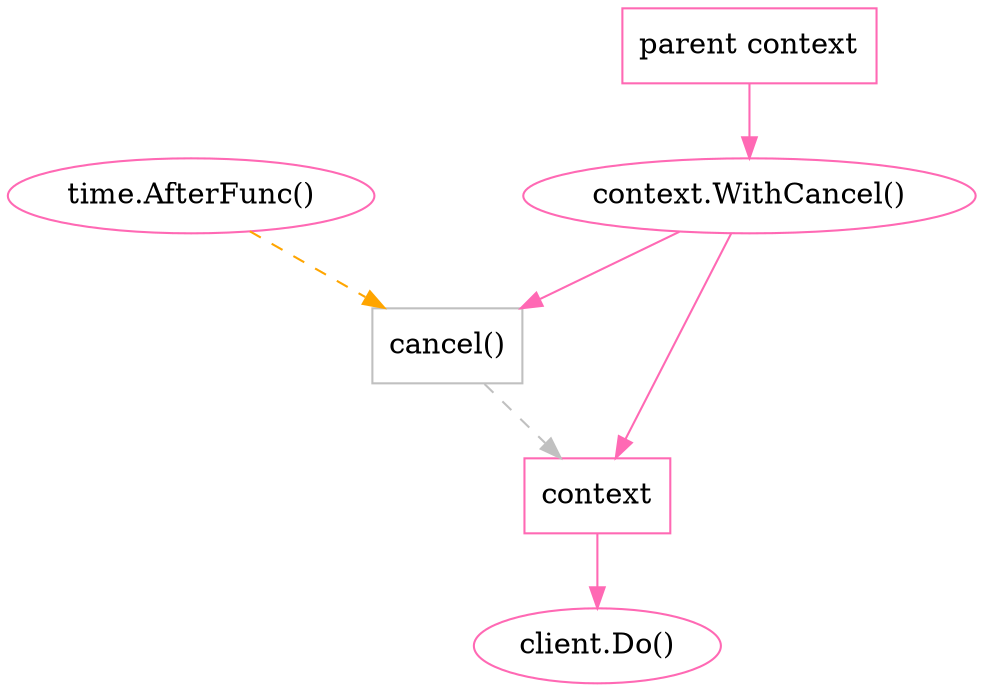

---
slideOptions:
  spotlight:
    enabled: false
  allottedMinutes: 25
---
net & http & timeout
===

<!-- .slide: data-background-color="pink" -->
<!-- .slide: data-transition="zoom" -->

> [name=郭學聰 Hsueh-Tsung Kuo]
> [time=Sun, 02 Aug 2020] [color=red]

######  CC BY-SA 4.0

---

<!-- .slide: data-transition="convex" -->

## Who am I?


<small>Someone (who?) said:
a game programmer should be able to draw cute anime character(?)</small>

----

<!-- .slide: data-transition="convex" -->

* A programmer from game company in Taiwan
* Backend (and temporary frontend) engineer, focus on common service
* Usually develop something related to my work in Python, Ruby, ECMAScript, Golang, C#
* ECMAScript hater since **Netscape** is dead

----

<!-- .slide: data-transition="convex" -->

* Built CDN-aware game asset update system
* Built almost entire VOEZ game server by myself only
* Supported Sdorica backend development
* Verify and tweak Soul of Eden backend performance

---

<!-- .slide: data-transition="convex" -->

## Outline

----

<!-- .slide: data-transition="convex" -->

4. net/http
5. net/http Timeout
    * Reason 
    * Spec
      * Server
      * Client
6. Streaming & Timeout
7. Implementation
8. Timer Issues
9. Conclusion
10. Reference
11. Q&A

---

<!-- .slide: data-transition="convex" -->

## net/http

----

<!-- .slide: data-transition="convex" -->

### Information

https://golang.org/pkg/net/http/

----

<!-- .slide: data-transition="convex" -->

### Feature

* HTTP
  * Client
  * Server
  * Hijack
      * WebSocket

---

<!-- .slide: data-transition="convex" -->

## net/http Timeout

----

<!-- .slide: data-transition="convex" -->

### Reason

Leak File Descriptors

```
http: Accept error: accept tcp [::]:80: accept4: too many open files; retrying in 5ms
```

----

<!-- .slide: data-transition="convex" -->

### Reason

Slowloris
<small>https://en.wikipedia.org/wiki/Slowloris_(computer_security)</small>

----

<!-- .slide: data-transition="convex" -->

### Spec

The complete guide to Go net/http timeouts

<small>https://blog.cloudflare.com/the-complete-guide-to-golang-net-http-timeouts/</small>

----

<!-- .slide: data-transition="convex" -->

#### Server


----

<!-- .slide: data-transition="convex" -->

##### Phase Timeout

```go=
srv := &http.Server{
    ReadTimeout:       5 * time.Second,
    WriteTimeout:      10 * time.Second,
    IdleTimeout:       60 * time.Second,
    ReadHeaderTimeout: 1 * time.Second,
}
log.Println(srv.ListenAndServe())
```

----

<!-- .slide: data-transition="convex" -->

#### Client


----

<!-- .slide: data-transition="convex" -->

##### Entire Timeout

```go=
c := &http.Client{
    Timeout: 15 * time.Second,
}
resp, err := c.Get("https://blog.filippo.io/")
```

----

<!-- .slide: data-transition="convex" -->

##### Phase Timeout

```go=
c := &http.Client{
    Transport: &http.Transport{
        Dial: (&net.Dialer{
                Timeout:   30 * time.Second,
                KeepAlive: 30 * time.Second,
        }).Dial,
        TLSHandshakeTimeout:   10 * time.Second,
        ResponseHeaderTimeout: 10 * time.Second,
        ExpectContinueTimeout: 1 * time.Second,
        IdleConnTimeout:       60 * time.Second,
    }
}
```

---

<!-- .slide: data-transition="convex" -->

## Streaming & Timeout

----

<!-- .slide: data-transition="convex" -->

### Phase Timeout


----

<!-- .slide: data-transition="convex" -->

### Streaming Timeout

<small>net/http: no way of manipulating timeouts in Handler #16100</small>
https://github.com/golang/go/issues/16100

----

<!-- .slide: data-transition="convex" -->

### Streaming Timeout per Entrypoint

# It does not exist!

----

<!-- .slide: data-transition="zoom" -->

#### Game Over?

* Good Game... GG
* 人生ｵﾜﾀ ＼(^ o ^)／

# :shit: :shit: :shit:

----

<!-- .slide: data-transition="zoom" -->

#### Open Source

# Do It Yourself

---

<!-- .slide: data-transition="convex" -->

## Implementation

----

<!-- .slide: data-transition="convex" -->

### fieliapm/stream-http-go

* Repository
  * https://github.com/fieliapm/stream-http-go
* GoDoc
  * https://godoc.org/github.com/fieliapm/stream-http-go/pkg/stream_http

----

<!-- .slide: data-transition="convex" -->

#### Client

----

<!-- .slide: data-transition="convex" -->

##### Client Example

```go=
ctx := context.Background()

client := http.DefaultClient

requestMod := stream_http.RequestMod(func(req *http.Request) {
    req.Header.Set("Content-Type", "application/x-www-form-urlencoded")
    req.Header.Set("Authorization", "Bearer qawsedrftgyhujikolp")

    query := req.URL.Query()
    query.Add("param", "pvalue")
    req.URL.RawQuery = query.Encode()
})
requestTimeout := stream_http.Timeout(500 * time.Millisecond)

reqBody := bytes.NewBuffer([]byte("form=fvalue"))
var respBody bytes.Buffer

resp, err := stream_http.DoRequest(ctx, client, http.MethodPost, "http://httpbin.org/anything", reqBody, &respBody, requestMod, requestTimeout)
//resp, err := stream_http.DoRequest(ctx, client, http.MethodGet, "http://httpbin.org/status/401", nil, &respBody, requestMod, requestTimeout)
if err != nil {
    return err
}

fmt.Printf("get response with status code: %d\n%s\n", resp.StatusCode, respBody.String())
```

----

<!-- .slide: data-transition="convex" -->

##### Spirit

* context :arrow_forward: context, cancel()
  * :warning: timeout event :arrow_right: cancel()
  * :heavy_check_mark: chunk transmitted :arrow_right: reset timeout <!-- .element: class="fragment" data-fragment-index="1" -->

----

<!-- .slide: data-transition="convex" -->

##### Client Control Flow



----

<!-- .slide: data-transition="convex" -->

#### Server

----

<!-- .slide: data-transition="convex" -->

##### Server Example

```go=
func handleFunc(w http.ResponseWriter, req *http.Request) {
    n, err := stream_http.TimeoutCopy(&reqBody, req.Body, time.Duration(-1), 500*time.Millisecond)

    n, err = stream_http.TimeoutCopy(w, &respBody, 500*time.Millisecond, time.Duration(-1))
}
```

----

<!-- .slide: data-transition="convex" -->

##### Spirit

* TimeoutCopy() :arrow_forward: copy goroutine
  * :heavy_check_mark: chunk transmitted :arrow_right: reset timeout <!-- .element: class="fragment" data-fragment-index="1" -->
  * :warning: timeout event :arrow_right: TimeoutCopy() <!-- .element: class="fragment" data-fragment-index="2" -->
    * TimeoutCopy() :arrow_right: :x: copy goroutine <!-- .element: class="fragment" data-fragment-index="3" -->

----

<!-- .slide: data-transition="convex" -->

##### Server Handle Flow

```sequence
note left of handler: receive request
handler->TimeoutCopy(): call
TimeoutCopy()->runtimeTimer: time.NewTimer()
TimeoutCopy()->copy goroutine: request/response_writer

note right of copy goroutine: chunk transmitted
copy goroutine->runtimeTimer: timer.Reset()/timer.Stop()

note right of copy goroutine: copy finished
copy goroutine->TimeoutCopy(): copyResult/panic
TimeoutCopy()->handler: copy result
note left of handler: send ok/error response

note right of runtimeTimer: timeout
runtimeTimer->TimeoutCopy(): timer.C
TimeoutCopy()->handler: error timeout
TimeoutCopy()->copy goroutine: close(doneChan)
note left of handler: send timeout response
```

----

<!-- .slide: data-transition="convex" -->

##### Question

How to correctly stop server handler?

----

<!-- .slide: data-transition="convex" -->

##### Answer

# I don't know

¯\\\_(ツ)\_/¯

---

<!-- .slide: data-transition="convex" -->

## Timer Issues

----

<!-- .slide: data-transition="convex" -->

<small>time: Timer.C can still trigger even after Timer.Reset is called #11513</small>
https://github.com/golang/go/issues/11513

----

<!-- .slide: data-transition="convex" -->

Timer.Reset() note
https://golang.org/pkg/time/#Timer.Reset

<small>
Reset should be invoked only on stopped or expired timers with drained channels. If a program has already received a value from t.C, the timer is known to have expired and the channel drained, so t.Reset can be used directly. If a program has not yet received a value from t.C, however, the timer must be stopped and—if Stop reports that the timer expired before being stopped—the channel explicitly drained:
</small>

```go=
if !t.Stop() {
    <-t.C
}
t.Reset(d)
```

<small>
This should not be done concurrent to other receives from the Timer's channel.
</small>

----

<!-- .slide: data-transition="convex" -->

<small>time: Timer.Reset is not possible to use correctly #14038</small>
https://github.com/golang/go/issues/14038

----

<!-- .slide: data-transition="convex" -->

Timer.Reset() note
https://golang.org/pkg/time/#Timer.Reset

<small>
Note that it is not possible to use Reset's return value correctly, as there is a race condition between draining the channel and the new timer expiring. Reset should always be invoked on stopped or expired channels, as described above. The return value exists to preserve compatibility with existing programs.
</small>

----

<!-- .slide: data-transition="convex" -->

### Understand Timer Behaviour

```go=
if !t.Stop() {
    <-t.C // don't do this if t.C is drained from another goroutine
}
_ = t.Reset(d) // don't use return value
```

----

<!-- .slide: data-transition="convex" -->

### Broken Timer Implementation

* Go version
  * go \< 1.8 :arrow_right: crap <!-- .element: class="fragment" data-fragment-index="1" -->
  * go \>= 1.8 (added note) :arrow_right: crap <!-- .element: class="fragment" data-fragment-index="2" -->

----

<!-- .slide: data-transition="convex" -->

### History Repeats Itself

* <small>time: Timer.C can still trigger even after Timer.Reset is called #11513</small>
* <small>time: Timer.Reset is not possible to use correctly #14038</small>
* <small>... ...</small>

----

<!-- .slide: data-transition="convex" -->


<small>Georg Wilhelm Friedrich Hegel
https://de.wikipedia.org/wiki/Georg_Wilhelm_Friedrich_Hegel</small>

----

<!-- .slide: data-transition="convex" -->

> <small> Was die Erfahrung aber und die Geschichte lehren, ist dieses, daß **Völker und Regierungen niemals etwas aus der Geschichte gelernt** und nach Lehren, die aus derselben zu ziehen gewesen wären, gehandelt haben. </small>
> [name=Georg Wilhelm Friedrich Hegel]

:dizzy:

----

<!-- .slide: data-transition="convex" -->

> <small> We learn from history that **we do not learn from history**. </small>
> [name=Georg Wilhelm Friedrich Hegel]

---

<!-- .slide: data-transition="convex" -->

## Conclusion

----

<!-- .slide: data-transition="convex" -->

### Contribute!

* fieliapm/stream-http-go
  * Better client interface
  * Server side timeout handling example
    * How to correctly stop server handler

> [name=郭學聰 Hsueh-Tsung Kuo] [time=2020_08_02] [color=red] :notebook:

---

<!-- .slide: data-transition="convex" -->

## Reference

----

<!-- .slide: data-transition="convex" -->

### Blog

* The complete guide to Go net/http timeouts \[en\]
  * <small>https://blog.cloudflare.com/the-complete-guide-to-golang-net-http-timeouts/</small>
* How to use timer reset in Golang correctly \[zh\]
  * <small>https://tonybai.com/2016/12/21/how-to-use-timer-reset-in-golang-correctly/</small>

---

<!-- .slide: data-transition="zoom" -->

## Q&A

---

<style>
.reveal {
    background: #FFDFEF;
    color: black;
}
.reveal h2,
.reveal h3,
.reveal h4,
.reveal h5,
.reveal h6 {
    color: black;
}
.reveal code {
    font-size: 18px !important;
    line-height: 1.2;
}

.progress div{
height:14px !important;
background: hotpink !important;
}

// original template

.rightpart{
    float:right;
    width:50%;
}

.leftpart{
    margin-right: 50% !important;
    height:50%;
}
.reveal section img { background:none; border:none; box-shadow:none; }
p.blo {
	font-size: 50px !important;
	background:#B6BDBB;
	border:1px solid silver;
	display:inline-block;
	padding:0.5em 0.75em;
	border-radius: 10px;
	box-shadow: 5px 5px 5px #666;
}

p.blo1 {
	background: #c7c2bb;
}
p.blo2 {
	background: #b8c0c8;
}
p.blo3 {
	background: #c7cedd;
}

p.bloT {
	font-size: 60px !important;
	background:#B6BDD3;
	border:1px solid silver;
	display:inline-block;
	padding:0.5em 0.75em;
	border-radius: 8px;
	box-shadow: 1px 2px 5px #333;
}
p.bloA {
	background: #B6BDE3;
}
p.bloB {
	background: #E3BDB3;
}

.slide-number{
	margin-bottom:10px !important;
	width:100%;
	text-align:center;
	font-size:25px !important;
	background-color:transparent !important;
}
iframe.myclass{
	width:100px;
	height:100px;
	bottom:0;
	left:0;
	position:fixed;
	border:none;
	z-index:99999;
}
h1.raw {
	color: #fff;
	background-image: linear-gradient(90deg,#f35626,#feab3a);
	-webkit-background-clip: text;
	-webkit-text-fill-color: transparent;
	animation: hue 5s infinite linear;
}
@keyframes hue {
	from {
	  filter: hue-rotate(0deg);
	}
	to {
	  filter: hue-rotate(360deg);
	}
}
.progress{
height:14px !important;
}

.progress span{
height:14px !important;
background: url("data:image/png;base64,iVBORw0KGgoAAAANSUhEUgAAAAEAAAAMCAIAAAAs6UAAAAAAGXRFWHRTb2Z0d2FyZQBBZG9iZSBJbWFnZVJlYWR5ccllPAAAAyJpVFh0WE1MOmNvbS5hZG9iZS54bXAAAAAAADw/eHBhY2tldCBiZWdpbj0i77u/IiBpZD0iVzVNME1wQ2VoaUh6cmVTek5UY3prYzlkIj8+IDx4OnhtcG1ldGEgeG1sbnM6eD0iYWRvYmU6bnM6bWV0YS8iIHg6eG1wdGs9IkFkb2JlIFhNUCBDb3JlIDUuMy1jMDExIDY2LjE0NTY2MSwgMjAxMi8wMi8wNi0xNDo1NjoyNyAgICAgICAgIj4gPHJkZjpSREYgeG1sbnM6cmRmPSJodHRwOi8vd3d3LnczLm9yZy8xOTk5LzAyLzIyLXJkZi1zeW50YXgtbnMjIj4gPHJkZjpEZXNjcmlwdGlvbiByZGY6YWJvdXQ9IiIgeG1sbnM6eG1wPSJodHRwOi8vbnMuYWRvYmUuY29tL3hhcC8xLjAvIiB4bWxuczp4bXBNTT0iaHR0cDovL25zLmFkb2JlLmNvbS94YXAvMS4wL21tLyIgeG1sbnM6c3RSZWY9Imh0dHA6Ly9ucy5hZG9iZS5jb20veGFwLzEuMC9zVHlwZS9SZXNvdXJjZVJlZiMiIHhtcDpDcmVhdG9yVG9vbD0iQWRvYmUgUGhvdG9zaG9wIENTNiAoV2luZG93cykiIHhtcE1NOkluc3RhbmNlSUQ9InhtcC5paWQ6QUNCQzIyREQ0QjdEMTFFMzlEMDM4Qzc3MEY0NzdGMDgiIHhtcE1NOkRvY3VtZW50SUQ9InhtcC5kaWQ6QUNCQzIyREU0QjdEMTFFMzlEMDM4Qzc3MEY0NzdGMDgiPiA8eG1wTU06RGVyaXZlZEZyb20gc3RSZWY6aW5zdGFuY2VJRD0ieG1wLmlpZDpBQ0JDMjJEQjRCN0QxMUUzOUQwMzhDNzcwRjQ3N0YwOCIgc3RSZWY6ZG9jdW1lbnRJRD0ieG1wLmRpZDpBQ0JDMjJEQzRCN0QxMUUzOUQwMzhDNzcwRjQ3N0YwOCIvPiA8L3JkZjpEZXNjcmlwdGlvbj4gPC9yZGY6UkRGPiA8L3g6eG1wbWV0YT4gPD94cGFja2V0IGVuZD0iciI/PovDFgYAAAAmSURBVHjaYvjPwMAAxjMZmBhA9H8INv4P4TPM/A+m04zBNECAAQBCWQv9SUQpVgAAAABJRU5ErkJggg==") repeat-x !important;

}

.progress span:after,
.progress span.nyancat{
	content: "";
	background: url('data:image/gif;base64,R0lGODlhIgAVAKIHAL3/9/+Zmf8zmf/MmZmZmf+Z/wAAAAAAACH/C05FVFNDQVBFMi4wAwEAAAAh/wtYTVAgRGF0YVhNUDw/eHBhY2tldCBiZWdpbj0i77u/IiBpZD0iVzVNME1wQ2VoaUh6cmVTek5UY3prYzlkIj8+IDx4OnhtcG1ldGEgeG1sbnM6eD0iYWRvYmU6bnM6bWV0YS8iIHg6eG1wdGs9IkFkb2JlIFhNUCBDb3JlIDUuMy1jMDExIDY2LjE0NTY2MSwgMjAxMi8wMi8wNi0xNDo1NjoyNyAgICAgICAgIj4gPHJkZjpSREYgeG1sbnM6cmRmPSJodHRwOi8vd3d3LnczLm9yZy8xOTk5LzAyLzIyLXJkZi1zeW50YXgtbnMjIj4gPHJkZjpEZXNjcmlwdGlvbiByZGY6YWJvdXQ9IiIgeG1sbnM6eG1wTU09Imh0dHA6Ly9ucy5hZG9iZS5jb20veGFwLzEuMC9tbS8iIHhtbG5zOnN0UmVmPSJodHRwOi8vbnMuYWRvYmUuY29tL3hhcC8xLjAvc1R5cGUvUmVzb3VyY2VSZWYjIiB4bWxuczp4bXA9Imh0dHA6Ly9ucy5hZG9iZS5jb20veGFwLzEuMC8iIHhtcE1NOk9yaWdpbmFsRG9jdW1lbnRJRD0ieG1wLmRpZDpDMkJBNjY5RTU1NEJFMzExOUM4QUM2MDAwNDQzRERBQyIgeG1wTU06RG9jdW1lbnRJRD0ieG1wLmRpZDpCREIzOEIzMzRCN0IxMUUzODhEQjgwOTYzMTgyNTE0QiIgeG1wTU06SW5zdGFuY2VJRD0ieG1wLmlpZDpCREIzOEIzMjRCN0IxMUUzODhEQjgwOTYzMTgyNTE0QiIgeG1wOkNyZWF0b3JUb29sPSJBZG9iZSBQaG90b3Nob3AgQ1M2IChXaW5kb3dzKSI+IDx4bXBNTTpEZXJpdmVkRnJvbSBzdFJlZjppbnN0YW5jZUlEPSJ4bXAuaWlkOkM1QkE2NjlFNTU0QkUzMTE5QzhBQzYwMDA0NDNEREFDIiBzdFJlZjpkb2N1bWVudElEPSJ4bXAuZGlkOkMyQkE2NjlFNTU0QkUzMTE5QzhBQzYwMDA0NDNEREFDIi8+IDwvcmRmOkRlc2NyaXB0aW9uPiA8L3JkZjpSREY+IDwveDp4bXBtZXRhPiA8P3hwYWNrZXQgZW5kPSJyIj8+Af/+/fz7+vn49/b19PPy8fDv7u3s6+rp6Ofm5eTj4uHg397d3Nva2djX1tXU09LR0M/OzczLysnIx8bFxMPCwcC/vr28u7q5uLe2tbSzsrGwr66trKuqqainpqWko6KhoJ+enZybmpmYl5aVlJOSkZCPjo2Mi4qJiIeGhYSDgoGAf359fHt6eXh3dnV0c3JxcG9ubWxramloZ2ZlZGNiYWBfXl1cW1pZWFdWVVRTUlFQT05NTEtKSUhHRkVEQ0JBQD8+PTw7Ojk4NzY1NDMyMTAvLi0sKyopKCcmJSQjIiEgHx4dHBsaGRgXFhUUExIREA8ODQwLCgkIBwYFBAMCAQAAIfkECQcABwAsAAAAACIAFQAAA6J4umv+MDpG6zEj682zsRaWFWRpltoHMuJZCCRseis7xG5eDGp93bqCA7f7TFaYoIFAMMwczB5EkTzJllEUttmIGoG5bfPBjDawD7CsJC67uWcv2CRov929C/q2ZpcBbYBmLGk6W1BRY4MUDnMvJEsBAXdlknk2fCeRk2iJliAijpBlEmigjR0plKSgpKWvEUheF4tUZqZID1RHjEe8PsDBBwkAIfkECQcABwAsAAAAACIAFQAAA6B4umv+MDpG6zEj682zsRaWFWRpltoHMuJZCCRseis7xG5eDGp93TqS40XiKSYgTLBgIBAMqE/zmQSaZEzns+jQ9pC/5dQJ0VIv5KMVWxqb36opxHrNvu9ptPfGbmsBbgSAeRdydCdjXWRPchQPh1hNAQF4TpM9NnwukpRyi5chGjqJEoSOIh0plaYsZBKvsCuNjY5ptElgDyFIuj6+vwcJACH5BAkHAAcALAAAAAAiABUAAAOfeLrc/vCZSaudUY7Nu99GxhhcYZ7oyYXiQQ5pIZgzCrYuLMd8MbAiUu802flYGIhwaCAQDKpQ86nUoWqF6dP00wIby572SXE6vyMrlmhuu9GKifWaddvNQAtszXYCxgR/Zy5jYTFeXmSDiIZGdQEBd06QSBQ5e4cEkE9nnZQaG2J4F4MSLx8rkqUSZBeurhlTUqsLsi60DpZxSWBJugcJACH5BAkHAAcALAAAAAAiABUAAAOgeLrc/vCZSaudUY7Nu99GxhhcYZ7oyYXiQQ5pIZgzCrYuLMd8MbAiUu802flYGIhwaCAQDKpQ86nUoWqF6dP00wIby572SXE6vyMrlmhuu9GuifWaddvNwMkZtmY7AWMEgGcKY2ExXl5khFMVc0Z1AQF3TpJShDl8iASST2efloV5JTyJFpgOch8dgW9KZxexshGNLqgLtbW0SXFwvaJfCQAh+QQJBwAHACwAAAAAIgAVAAADoXi63P7wmUmrnVGOzbvfRsYYXGGe6MmF4kEOaSGYMwq2LizHfDGwIlLPNKGZfi6gZmggEAy2iVPZEKZqzakq+1xUFFYe90lxTsHmim6HGpvf3eR7skYJ3PC5tyystc0AboFnVXQ9XFJTZIQOYUYFTQEBeWaSVF4bbCeRk1meBJYSL3WbaReMIxQfHXh6jaYXsbEQni6oaF21ERR7l0ksvA0JACH5BAkHAAcALAAAAAAiABUAAAOeeLrc/vCZSaudUY7Nu99GxhhcYZ7oyYXiQQ5pIZgzCrYuLMfFlA4hTITEMxkIBMOuADwmhzqeM6mashTCXKw2TVKQyKuTRSx2wegnNkyJ1ozpOFiMLqcEU8BZHx6NYW8nVlZefQ1tZgQBAXJIi1eHUTRwi0lhl48QL0sogxaGDhMlUo2gh14fHhcVmnOrrxNqrU9joX21Q0IUElm7DQkAIfkECQcABwAsAAAAACIAFQAAA6J4umv+MDpG6zEj682zsRaWFWRpltoHMuJZCCRseis7xG5eDGp93bqCA7f7TFaYoIFAMMwczB5EkTzJllEUttmIGoG5bfPBjDawD7CsJC67uWcv2CRov929C/q2ZpcBbYBmLGk6W1BRY4MUDnMvJEsBAXdlknk2fCeRk2iJliAijpBlEmigjR0plKSgpKWvEUheF4tUZqZID1RHjEe8PsDBBwkAIfkECQcABwAsAAAAACIAFQAAA6B4umv+MDpG6zEj682zsRaWFWRpltoHMuJZCCRseis7xG5eDGp93TqS40XiKSYgTLBgIBAMqE/zmQSaZEzns+jQ9pC/5dQJ0VIv5KMVWxqb36opxHrNvu9ptPfGbmsBbgSAeRdydCdjXWRPchQPh1hNAQF4TpM9NnwukpRyi5chGjqJEoSOIh0plaYsZBKvsCuNjY5ptElgDyFIuj6+vwcJACH5BAkHAAcALAAAAAAiABUAAAOfeLrc/vCZSaudUY7Nu99GxhhcYZ7oyYXiQQ5pIZgzCrYuLMd8MbAiUu802flYGIhwaCAQDKpQ86nUoWqF6dP00wIby572SXE6vyMrlmhuu9GKifWaddvNQAtszXYCxgR/Zy5jYTFeXmSDiIZGdQEBd06QSBQ5e4cEkE9nnZQaG2J4F4MSLx8rkqUSZBeurhlTUqsLsi60DpZxSWBJugcJACH5BAkHAAcALAAAAAAiABUAAAOgeLrc/vCZSaudUY7Nu99GxhhcYZ7oyYXiQQ5pIZgzCrYuLMd8MbAiUu802flYGIhwaCAQDKpQ86nUoWqF6dP00wIby572SXE6vyMrlmhuu9GuifWaddvNwMkZtmY7AWMEgGcKY2ExXl5khFMVc0Z1AQF3TpJShDl8iASST2efloV5JTyJFpgOch8dgW9KZxexshGNLqgLtbW0SXFwvaJfCQAh+QQJBwAHACwAAAAAIgAVAAADoXi63P7wmUmrnVGOzbvfRsYYXGGe6MmF4kEOaSGYMwq2LizHfDGwIlLPNKGZfi6gZmggEAy2iVPZEKZqzakq+1xUFFYe90lxTsHmim6HGpvf3eR7skYJ3PC5tyystc0AboFnVXQ9XFJTZIQOYUYFTQEBeWaSVF4bbCeRk1meBJYSL3WbaReMIxQfHXh6jaYXsbEQni6oaF21ERR7l0ksvA0JACH5BAkHAAcALAAAAAAiABUAAAOeeLrc/vCZSaudUY7Nu99GxhhcYZ7oyYXiQQ5pIZgzCrYuLMfFlA4hTITEMxkIBMOuADwmhzqeM6mashTCXKw2TVKQyKuTRSx2wegnNkyJ1ozpOFiMLqcEU8BZHx6NYW8nVlZefQ1tZgQBAXJIi1eHUTRwi0lhl48QL0sogxaGDhMlUo2gh14fHhcVmnOrrxNqrU9joX21Q0IUElm7DQkAOw==') !important;
   width: 34px !important;
   height: 21px !important;
   border: none !important;
   float:right;
   margin-top:-7px;
   margin-right:-10px;
}
</style>

