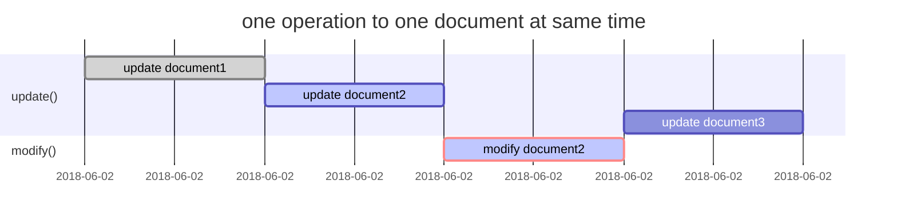
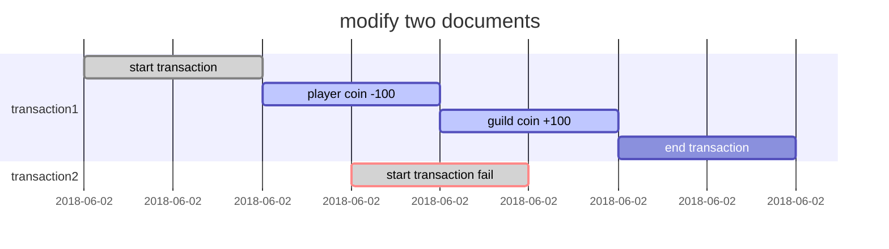
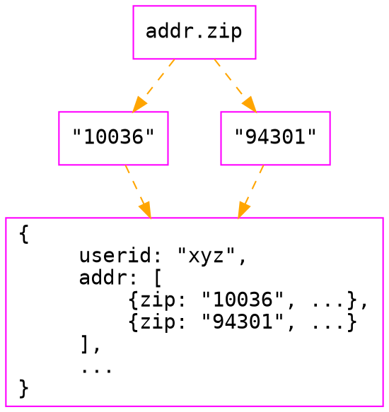
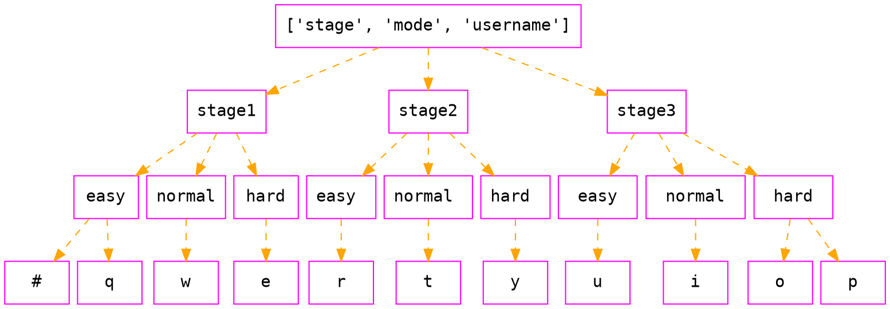

MongoEngine Inside
===

<!-- .slide: data-background="pink" -->
<!-- .slide: data-transition="zoom" -->

the Detail of MongoDB & MongoEngine :dizzy:

> [name=郭學聰 Hsueh-Tsung Kuo] [time=Sat, 02 Jun 2018] [color=red]

---

<!-- .slide: data-transition="convex" -->

## who am I?


----

<!-- .slide: data-transition="convex" -->

* programmer from Rayark, a game company in Taiwan
* backend engineer, focus on common service
* usually develop something related to my work in Python, Ruby, Golang, C#
* built almost entire VOEZ game server by myself only
* supported Sdorica backend development

---

<!-- .slide: data-transition="convex" -->

## outline

----

<!-- .slide: data-transition="convex" -->

4. when MongoEngine
    1. PyMongo vs MongoEngine
5. from ORM to BSON
    1. deserialize & ~~serialize~~ :x: set :o:
    2. dereferencing
    3. pass needed fields "ONLY" (twice meaning)
6. race condition
    1. commands for updating data atomically
    2. ORM design & atomic
       1. denormalization
       2. referencing

----

<!-- .slide: data-transition="convex" -->

7. index
    1. index detail
        1. sortable or hash (non sortable)
        2. unique index
        3. array field & index
        4. others
    2. compound index
        1. efficient query casestudy
        2. how to assign efficient compound index
8. migration
    1. slow python meets time limited huge data migration

----

<!-- .slide: data-transition="convex" -->

9. conclusion
10. commercial
11. Q&A

---

<!-- .slide: data-transition="convex" -->

## when MongoEngine

----

<!-- .slide: data-transition="convex" -->

### PyMongo vs MongoEngine

* PyMongo
  * dict everywhere
  * query filter
* MongoEngine
  * Object Relational Mapping
  * Django query syntax

----

<!-- .slide: data-transition="convex" -->

```python=
# PyMongo
mongoClient['db']['collection'].insert({'first': {'second': {'third': 5}}})

mongoClient['db']['collection'].find({'first.second.third': {'$gte': 4}})
```

```python=
# MongoEngine
doc = Doc()
doc.first.second.third = 5
doc.save()

Doc.objects(first__second__third__gte=4)
```

---

<!-- .slide: data-transition="convex" -->

## from ORM to BSON

----

<!-- .slide: data-transition="convex" -->

ORM usage

```python=
class HighScore(mongoengine.document.Document):
    stage = mongoengine.fields.StringField(required=True)
    mode = mongoengine.fields.StringField(required=True)
    username = mongoengine.fields.StringField(required=True)
    score = mongoengine.fields.FloatField(required=True)
    timestamp = mongoengine.fields.DateTimeField(required=True)
    meta = {
        'indexes': [
            {
                'fields': ['stage', 'mode', '-score', '-timestamp', 'username'],
            },
            {
                'fields': ['stage', 'mode', 'username'],
                'unique': True,
            },
        ],
    }
```

----

<!-- .slide: data-transition="convex" -->

Python descriptors

```python=
field.__get__(self, doc, type=None) --> value
field.__set__(self, doc, value) --> None
field.__delete__(self, doc) --> None
```

----

<!-- .slide: data-transition="convex" -->

### deserialize & ~~serialize~~ :x: set :o:

----

<!-- .slide: data-transition="convex" -->

#### deserialize object from BSON

mongoengine/queryset/base.py

```python=
class BaseQuerySet(object):
......
    def next(self):
......
        if self._limit == 0 or self._none:
            raise StopIteration

        raw_doc = self._cursor.next()

        if self._as_pymongo:
            return self._get_as_pymongo(raw_doc)

        doc = self._document._from_son(
            raw_doc, _auto_dereference=self._auto_dereference,
            only_fields=self.only_fields)

        if self._scalar:
            return self._get_scalar(doc)

        return doc
```

----

<!-- .slide: data-transition="convex" -->

#### change field value

----

<!-- .slide: data-transition="convex" -->

mongoengine/base/fields.py

```python=
class BaseField(object):
......
    def __set__(self, instance, value):
......
        if instance._initialised:
            try:
                if (self.name not in instance._data or
                        instance._data[self.name] != value):
                    instance._mark_as_changed(self.name)
            except Exception:
                # Values cant be compared eg: naive and tz datetimes
                # So mark it as changed
                instance._mark_as_changed(self.name)
```

----

<!-- .slide: data-transition="convex" -->

#### save document after changing field value

mongoengine/document.py

```python=
class Document(BaseDocument):
......
    def save(self, force_insert=False, validate=True, clean=True,
             write_concern=None, cascade=None, cascade_kwargs=None,
             _refs=None, save_condition=None, signal_kwargs=None, **kwargs):
......
        try:
            # Save a new document or update an existing one
            if created:
                object_id = self._save_create(doc, force_insert, write_concern)
            else:
                object_id, created = self._save_update(doc, save_condition,
                                                       write_concern)
```

----

<!-- .slide: data-transition="convex" -->

```python=
    def _save_update(self, doc, save_condition, write_concern):
......
        update_doc = self._get_update_doc()
        if update_doc:
            upsert = save_condition is None
            last_error = collection.update(select_dict, update_doc,
                                           upsert=upsert, **write_concern)
````

----

<!-- .slide: data-transition="convex" -->

```python=
    def _get_update_doc(self):
......
        updates, removals = self._delta()

        update_doc = {}
        if updates:
            update_doc['$set'] = updates
        if removals:
            update_doc['$unset'] = removals

        return update_doc
```

----

<!-- .slide: data-transition="convex" -->

### dereferencing

mongoengine/fields.py

```python=
class ReferenceField(BaseField):
......
    def __get__(self, instance, owner):
......
            dereferenced = cls._get_db().dereference(value)
            if dereferenced is None:
                raise DoesNotExist('Trying to dereference unknown document %s' % value)
            else:
                instance._data[self.name] = cls._from_son(dereferenced)
```

----

<!-- .slide: data-transition="convex" -->

#### disadvantage & workaround

* read all referenced document just for one field
* LazyReferenceField
  * :o: get
  * :x: set
  * :x: delete

----

<!-- .slide: data-transition="convex" -->

### pass needed fields "ONLY" (twice meaning)

* query speed <!-- .element: class="fragment" data-fragment-index="1" -->
    * part of document > whole document 
* transfer size <!-- .element: class="fragment" data-fragment-index="2" -->
    * part of document < whole document

----

<!-- .slide: data-transition="convex" -->

```python=
high_scores_1 = HighScore.objects(...).only('username')
high_scores_2 = HighScore.objects(...).exclude('timestamp')
```

----

<!-- .slide: data-transition="convex" -->

```python=
high_score_1.save()
```

```
mongoengine.errors.ValidationError:
ValidationError (HighScore:0123456789abcdef01234567)
(Field is required: ['mode', 'song', 'score', 'timestamp'])
```

----

<!-- .slide: data-transition="convex" -->

full control <i class="fa fa-chain"></i>  ==**PyMongo**== <!-- .element: class="fragment" data-fragment-index="1" -->

---

<!-- .slide: data-transition="convex" -->

## race condition

----

<!-- .slide: data-transition="convex" -->

### commands for updating data atomically

```python=
# findAndModify(), single
old_high_score = HighScore.objects(stage='stage1', mode='hard', username='woshige')
        .modify(set__score=0.0)
# update(), single or multiple
HighScore.objects(stage='stage1', mode='hard')
        .update(multi=True, inc__score=100000.0)
```

----

<!-- .slide: data-transition="convex" -->

### ORM design & atomic

----

<!-- .slide: data-transition="convex" -->


----

<!-- .slide: data-transition="convex" -->

#### denormalization

* one operation to one document at same time
* large BSON -> ==docment size **limit**==
* example
  - player data update

----

<!-- .slide: data-transition="convex" -->

```sequence
service->database: update()
service->database: Doc.objects(doc='doc2').modify()
note right of database: collide at document2 ?
database-->service: old document2
database-->service: update() status
```

----

<!-- .slide: data-transition="convex" -->



----

<!-- .slide: data-transition="convex" -->

#### referencing

* DIY lock or state
* small BSON
* example
  - player coin -> guild coin

----

<!-- .slide: data-transition="convex" -->

```sequence
note right of service: unique index ['player', 'guild']
service->database: Transaction(player='1', guild='a', coin=100).save()
note right of database: session start
service->database: Player.objects(player="1").update(inc__coin=-100)
service->database: Transaction(player='1', guild='a', coin=200).save()
note right of database: fail!
service->database: Guild.objects(guild="a").update(inc__coin=100)
service->database: Transaction.objects(player='1', guild='a').delete()
note right of database: session end
```

----

<!-- .slide: data-transition="convex" -->



----

<!-- .slide: data-transition="convex" -->

Perform Two Phase Commits
* <small>https://docs.mongodb.com/manual/tutorial/perform-two-phase-commits/</small>

---

<!-- .slide: data-transition="convex" -->

## index

----

<!-- .slide: data-transition="convex" -->

### index detail

----

<!-- .slide: data-transition="convex" -->

#### sortable or hash (non sortable)

* sortable
  * equal, range, sort query
  * multikey
  * range sharding
* hash
  * equal query only
  * no multikey
  * ==**hash sharding**==
    * randomize <!-- .element: class="fragment" data-fragment-index="1" -->

----

<!-- .slide: data-transition="convex" -->

#### unique index

* ensures that the indexed fields do not store duplicate values

----

<!-- .slide: data-transition="convex" -->

```python=
class HighScore(mongoengine.document.Document):
    stage = mongoengine.fields.StringField(required=True)
    mode = mongoengine.fields.StringField(required=True)
    username = mongoengine.fields.StringField(required=True)
    score = mongoengine.fields.FloatField(required=True)
    timestamp = mongoengine.fields.DateTimeField(required=True)
    meta = {
        'indexes': [
            {
                'fields': ['stage', 'mode', '-score', '-timestamp', 'username'],
            },
            {
                'fields': ['stage', 'mode', 'username'],
                'unique': True,
            },
        ],
    }
```

----

<!-- .slide: data-transition="convex" -->

#### array field & index

* multikey index
  * index key for ==**each element**== in array

----

<!-- .slide: data-transition="convex" -->


----

<!-- .slide: data-transition="convex" -->



----

<!-- .slide: data-transition="convex" -->

#### others

* string search
  * text
* geospatial
  * 2d
  * 2dsphere
  * geoHaystack

----

<!-- .slide: data-transition="convex" -->

### compound index

* single index structure holds references to multiple fields

----

<!-- .slide: data-transition="convex" -->

```python=
class HighScore(mongoengine.document.Document):
    stage = mongoengine.fields.StringField(required=True)
    mode = mongoengine.fields.StringField(required=True)
    username = mongoengine.fields.StringField(required=True)
    score = mongoengine.fields.FloatField(required=True)
    timestamp = mongoengine.fields.DateTimeField(required=True)
    meta = {
        'indexes': [
            {
                'fields': ['stage', 'mode', '-score', '-timestamp', 'username'],
            },
            {
                'fields': ['stage', 'mode', 'username'],
                'unique': True,
            },
        ],
    }
```

----

<!-- .slide: data-transition="convex" -->



----

<!-- .slide: data-transition="convex" -->

:o: index can help query

```python=
HighScore.objects(stage='stage1', mode='hard', username='woshige')
HighScore.objects(stage='stage1', mode='hard')
HighScore.objects(stage='stage1')

HighScore.objects(stage='stage1', mode='hard', score__gte=1000000.0)
HighScore.objects(stage='stage1', mode='hard').order_by('-score', '-timestamp')
HighScore.objects(stage='stage1', mode='hard').order_by('-score')
```

----

<!-- .slide: data-transition="convex" -->

:x: index cannot help query

```python=
HighScore.objects(stage='stage1', username='woshige')
HighScore.objects(mode='hard', username='woshige')
HighScore.objects(mode='hard')
HighScore.objects(username='woshige')

HighScore.objects(stage='stage1', mode='hard').order_by('-timestamp')
```

----

<!-- .slide: data-transition="convex" -->

#### efficient query casestudy

----

<!-- .slide: data-transition="convex" -->

```python=
query_plan = HighScore.objects(...).explain()
```

----

<!-- .slide: data-transition="convex" -->

```python=
# MongoDB 3.x
{
    ......
    'executionStages': {
        'stage': 'SORT', # sort with CPU & RAM (true) or walk through sortable index (false)
    },
    ......
    'nReturned': 1, # number of documents that match the query condition
    'totalDocsExamined': 3, # number of documents scanned
    'totalKeysExamined': 5, # number of index entries scanned
    ......
}

# MongoDB 2.x
{
    ......
    'n' : 1, # number of documents that match the query condition
    'nscannedObjects': 3, # number of documents scanned
    'nscanned': 5, # number of index entries scanned
    'scanAndOrder': false # sort with CPU & RAM (true) or walk through sortable index (false)
    ......
}
```

----

<!-- .slide: data-transition="convex" -->

* stage = 10
* mode = 3
* user = 100
* high score document count = 3000

----

<!-- .slide: data-transition="convex" -->

equal + range

```python=
HighScore.objects(stage='stage1', mode='hard', username__gte='w').explain()

# ['username', 'stage', 'mode']
{
    'nReturned': 12,
    'totalDocsExamined': 12,
    'totalKeysExamined': 47,
}

# ['stage', 'mode', 'username']
{
    'nReturned': 12,
    'totalDocsExamined': 12,
    'totalKeysExamined': 12,
}
```

----

<!-- .slide: data-transition="convex" -->

equal + sort

```python=
HighScore.objects(stage='stage1', mode='hard')
    .order_by('-score', '-timestamp').explain()

# ['-score', '-timestamp', 'stage', 'mode']
{
    'nReturned': 100,
    'totalDocsExamined': 3000,
    'totalKeysExamined': 3000,
}

# ['stage', 'mode', '-score', '-timestamp']
{
    'nReturned': 100,
    'totalDocsExamined': 100,
    'totalKeysExamined': 100,
}
```

----

<!-- .slide: data-transition="convex" -->

equal + sort + range

```python=
HighScore.objects(stage='stage1', mode='hard', username__gte='w')
    .order_by('-score', '-timestamp').explain()

# ['-score', '-timestamp', 'stage', 'mode', 'username']
{
    'nReturned': 12,
    'totalDocsExamined': 3000,
    'totalKeysExamined': 3000,
}

# ['username', '-score', '-timestamp', 'stage', 'mode']
{
    'executionStages': {
        'stage': 'SORT',
    },
    .....
    'nReturned': 12,
    'totalDocsExamined': 12,
    'totalKeysExamined': 48,
}

# ['username', 'stage', 'mode', '-score', '-timestamp']
{
    'executionStages': {
        'stage': 'SORT',
    },
    .....
    'nReturned': 12,
    'totalDocsExamined': 12,
    'totalKeysExamined': 47,
}

# ['stage', 'mode', '-score', '-timestamp', 'username']
{
    'nReturned': 12,
    'totalDocsExamined': 12,
    'totalKeysExamined': 101,
}
```

----

<!-- .slide: data-transition="convex" -->

> :hash: "do not sort through database!!!" 
> [name=Hsueh-Tsung Kuo] [time=Sat, 02 Jun 2018] [color=red]
> <!-- .element: class="fragment" data-fragment-index="1" -->

----

<!-- .slide: data-transition="convex" -->

#### how to assign efficient compound index

* the gold indexing slogan
  * ==*equal*== <!-- .element: class="fragment" data-fragment-index="1" -->
  * ==*sort*== <!-- .element: class="fragment" data-fragment-index="2" -->
  * ==*range*== <!-- .element: class="fragment" data-fragment-index="3" -->

----

<!-- .slide: data-transition="convex" -->

* reference:
  * <small>https://emptysqua.re/blog/optimizing-mongodb-compound-indexes/</small>
  * <small>http://developers-club.com/posts/147053/</small>

---

<!-- .slide: data-transition="convex" -->

## migration

----

<!-- .slide: data-transition="convex" -->

### slow python meets time limited huge data migration

----

<!-- .slide: data-transition="convex" -->

```python=
# update(), single or multiple
HighScore.objects(stage='stage1', mode='hard')
        .update(multi=True, inc__score=100000.0)
```

---

<!-- .slide: data-transition="convex" -->

## conclusion

----

<!-- .slide: data-transition="convex" -->


----

<!-- .slide: data-transition="convex" -->

> :100: "equal, sort, range"
> [name=Hsueh-Tsung Kuo] [time=Sat, 02 Jun 2018] [color=red]

----

<!-- .slide: data-transition="convex" -->

### special thanks

* Rayark Inc.
  * CTO & CIO
  * Sdorica team
  * backend team
  * QA team
  * customer service team
  * IT team
  * other teams
* iKala Interactive Media Inc.

---

<!-- .slide: data-transition="zoom" -->

## commercial

Sdorica -sunset-

* <small>OP Animation https://youtu.be/ktGRO8tCBqs</small>
* <small>Global Launch Trailer https://youtu.be/2aY7il7zuNk</small>
* <small>Background Story https://youtu.be/9tOmgueeY7I</small>

----

<!-- .slide: data-transition="zoom" -->



----

<!-- .slide: data-transition="zoom" -->

# Rayark Wants You !

Rayark Careers | Make A Difference

* EN https://careers.rayark.com/jobs/
* ZH https://careers.rayark.com/zh/jobs/

---

<!-- .slide: data-transition="zoom" -->

## Q&A

---

<style>
.reveal {
    background: #FFDFEF;
    color: black;
}
.reveal h2,
.reveal h3,
.reveal h4 {
    color: black;
}
.reveal code {
    font-size: 16px !important;
    line-height: 1.2;
}

.rightpart{
    float:right;
    width:50%;
}

.leftpart{
    margin-right: 50% !important;
    height:50%;
}
.reveal section img { background:none; border:none; box-shadow:none; }
p.blo {
	font-size: 50px !important;
	background:#B6BDBB;
	border:1px solid silver;
	display:inline-block;
	padding:0.5em 0.75em;
	border-radius: 10px;
	box-shadow: 5px 5px 5px #666;
}

p.blo1 {
	background: #c7c2bb;
}
p.blo2 {
	background: #b8c0c8;
}
p.blo3 {
	background: #c7cedd;
}

p.bloT {
	font-size: 60px !important;
	background:#B6BDD3;
	border:1px solid silver;
	display:inline-block;
	padding:0.5em 0.75em;
	border-radius: 8px;
	box-shadow: 1px 2px 5px #333;
}
p.bloA {
	background: #B6BDE3;
}
p.bloB {
	background: #E3BDB3;
}

.slide-number{
	margin-bottom:10px !important;
	width:100%;
	text-align:center;
	font-size:25px !important;
	background-color:transparent !important;
}
iframe.myclass{
	width:100px;
	height:100px;
	bottom:0;
	left:0;
	position:fixed;
	border:none;
	z-index:99999;
}
h1.raw {
	color: #fff;
	background-image: linear-gradient(90deg,#f35626,#feab3a);
	-webkit-background-clip: text;
	-webkit-text-fill-color: transparent;
	animation: hue 5s infinite linear;
}
@keyframes hue {
	from {
	  filter: hue-rotate(0deg);
	}
	to {
	  filter: hue-rotate(360deg);
	}
}
.progress{
height:14px !important;
}

.progress span{
height:14px !important;
background: url("data:image/png;base64,iVBORw0KGgoAAAANSUhEUgAAAAEAAAAMCAIAAAAs6UAAAAAAGXRFWHRTb2Z0d2FyZQBBZG9iZSBJbWFnZVJlYWR5ccllPAAAAyJpVFh0WE1MOmNvbS5hZG9iZS54bXAAAAAAADw/eHBhY2tldCBiZWdpbj0i77u/IiBpZD0iVzVNME1wQ2VoaUh6cmVTek5UY3prYzlkIj8+IDx4OnhtcG1ldGEgeG1sbnM6eD0iYWRvYmU6bnM6bWV0YS8iIHg6eG1wdGs9IkFkb2JlIFhNUCBDb3JlIDUuMy1jMDExIDY2LjE0NTY2MSwgMjAxMi8wMi8wNi0xNDo1NjoyNyAgICAgICAgIj4gPHJkZjpSREYgeG1sbnM6cmRmPSJodHRwOi8vd3d3LnczLm9yZy8xOTk5LzAyLzIyLXJkZi1zeW50YXgtbnMjIj4gPHJkZjpEZXNjcmlwdGlvbiByZGY6YWJvdXQ9IiIgeG1sbnM6eG1wPSJodHRwOi8vbnMuYWRvYmUuY29tL3hhcC8xLjAvIiB4bWxuczp4bXBNTT0iaHR0cDovL25zLmFkb2JlLmNvbS94YXAvMS4wL21tLyIgeG1sbnM6c3RSZWY9Imh0dHA6Ly9ucy5hZG9iZS5jb20veGFwLzEuMC9zVHlwZS9SZXNvdXJjZVJlZiMiIHhtcDpDcmVhdG9yVG9vbD0iQWRvYmUgUGhvdG9zaG9wIENTNiAoV2luZG93cykiIHhtcE1NOkluc3RhbmNlSUQ9InhtcC5paWQ6QUNCQzIyREQ0QjdEMTFFMzlEMDM4Qzc3MEY0NzdGMDgiIHhtcE1NOkRvY3VtZW50SUQ9InhtcC5kaWQ6QUNCQzIyREU0QjdEMTFFMzlEMDM4Qzc3MEY0NzdGMDgiPiA8eG1wTU06RGVyaXZlZEZyb20gc3RSZWY6aW5zdGFuY2VJRD0ieG1wLmlpZDpBQ0JDMjJEQjRCN0QxMUUzOUQwMzhDNzcwRjQ3N0YwOCIgc3RSZWY6ZG9jdW1lbnRJRD0ieG1wLmRpZDpBQ0JDMjJEQzRCN0QxMUUzOUQwMzhDNzcwRjQ3N0YwOCIvPiA8L3JkZjpEZXNjcmlwdGlvbj4gPC9yZGY6UkRGPiA8L3g6eG1wbWV0YT4gPD94cGFja2V0IGVuZD0iciI/PovDFgYAAAAmSURBVHjaYvjPwMAAxjMZmBhA9H8INv4P4TPM/A+m04zBNECAAQBCWQv9SUQpVgAAAABJRU5ErkJggg==") repeat-x !important;

}

.progress span:after,
.progress span.nyancat{
	content: "";
	background: url('data:image/gif;base64,R0lGODlhIgAVAKIHAL3/9/+Zmf8zmf/MmZmZmf+Z/wAAAAAAACH/C05FVFNDQVBFMi4wAwEAAAAh/wtYTVAgRGF0YVhNUDw/eHBhY2tldCBiZWdpbj0i77u/IiBpZD0iVzVNME1wQ2VoaUh6cmVTek5UY3prYzlkIj8+IDx4OnhtcG1ldGEgeG1sbnM6eD0iYWRvYmU6bnM6bWV0YS8iIHg6eG1wdGs9IkFkb2JlIFhNUCBDb3JlIDUuMy1jMDExIDY2LjE0NTY2MSwgMjAxMi8wMi8wNi0xNDo1NjoyNyAgICAgICAgIj4gPHJkZjpSREYgeG1sbnM6cmRmPSJodHRwOi8vd3d3LnczLm9yZy8xOTk5LzAyLzIyLXJkZi1zeW50YXgtbnMjIj4gPHJkZjpEZXNjcmlwdGlvbiByZGY6YWJvdXQ9IiIgeG1sbnM6eG1wTU09Imh0dHA6Ly9ucy5hZG9iZS5jb20veGFwLzEuMC9tbS8iIHhtbG5zOnN0UmVmPSJodHRwOi8vbnMuYWRvYmUuY29tL3hhcC8xLjAvc1R5cGUvUmVzb3VyY2VSZWYjIiB4bWxuczp4bXA9Imh0dHA6Ly9ucy5hZG9iZS5jb20veGFwLzEuMC8iIHhtcE1NOk9yaWdpbmFsRG9jdW1lbnRJRD0ieG1wLmRpZDpDMkJBNjY5RTU1NEJFMzExOUM4QUM2MDAwNDQzRERBQyIgeG1wTU06RG9jdW1lbnRJRD0ieG1wLmRpZDpCREIzOEIzMzRCN0IxMUUzODhEQjgwOTYzMTgyNTE0QiIgeG1wTU06SW5zdGFuY2VJRD0ieG1wLmlpZDpCREIzOEIzMjRCN0IxMUUzODhEQjgwOTYzMTgyNTE0QiIgeG1wOkNyZWF0b3JUb29sPSJBZG9iZSBQaG90b3Nob3AgQ1M2IChXaW5kb3dzKSI+IDx4bXBNTTpEZXJpdmVkRnJvbSBzdFJlZjppbnN0YW5jZUlEPSJ4bXAuaWlkOkM1QkE2NjlFNTU0QkUzMTE5QzhBQzYwMDA0NDNEREFDIiBzdFJlZjpkb2N1bWVudElEPSJ4bXAuZGlkOkMyQkE2NjlFNTU0QkUzMTE5QzhBQzYwMDA0NDNEREFDIi8+IDwvcmRmOkRlc2NyaXB0aW9uPiA8L3JkZjpSREY+IDwveDp4bXBtZXRhPiA8P3hwYWNrZXQgZW5kPSJyIj8+Af/+/fz7+vn49/b19PPy8fDv7u3s6+rp6Ofm5eTj4uHg397d3Nva2djX1tXU09LR0M/OzczLysnIx8bFxMPCwcC/vr28u7q5uLe2tbSzsrGwr66trKuqqainpqWko6KhoJ+enZybmpmYl5aVlJOSkZCPjo2Mi4qJiIeGhYSDgoGAf359fHt6eXh3dnV0c3JxcG9ubWxramloZ2ZlZGNiYWBfXl1cW1pZWFdWVVRTUlFQT05NTEtKSUhHRkVEQ0JBQD8+PTw7Ojk4NzY1NDMyMTAvLi0sKyopKCcmJSQjIiEgHx4dHBsaGRgXFhUUExIREA8ODQwLCgkIBwYFBAMCAQAAIfkECQcABwAsAAAAACIAFQAAA6J4umv+MDpG6zEj682zsRaWFWRpltoHMuJZCCRseis7xG5eDGp93bqCA7f7TFaYoIFAMMwczB5EkTzJllEUttmIGoG5bfPBjDawD7CsJC67uWcv2CRov929C/q2ZpcBbYBmLGk6W1BRY4MUDnMvJEsBAXdlknk2fCeRk2iJliAijpBlEmigjR0plKSgpKWvEUheF4tUZqZID1RHjEe8PsDBBwkAIfkECQcABwAsAAAAACIAFQAAA6B4umv+MDpG6zEj682zsRaWFWRpltoHMuJZCCRseis7xG5eDGp93TqS40XiKSYgTLBgIBAMqE/zmQSaZEzns+jQ9pC/5dQJ0VIv5KMVWxqb36opxHrNvu9ptPfGbmsBbgSAeRdydCdjXWRPchQPh1hNAQF4TpM9NnwukpRyi5chGjqJEoSOIh0plaYsZBKvsCuNjY5ptElgDyFIuj6+vwcJACH5BAkHAAcALAAAAAAiABUAAAOfeLrc/vCZSaudUY7Nu99GxhhcYZ7oyYXiQQ5pIZgzCrYuLMd8MbAiUu802flYGIhwaCAQDKpQ86nUoWqF6dP00wIby572SXE6vyMrlmhuu9GKifWaddvNQAtszXYCxgR/Zy5jYTFeXmSDiIZGdQEBd06QSBQ5e4cEkE9nnZQaG2J4F4MSLx8rkqUSZBeurhlTUqsLsi60DpZxSWBJugcJACH5BAkHAAcALAAAAAAiABUAAAOgeLrc/vCZSaudUY7Nu99GxhhcYZ7oyYXiQQ5pIZgzCrYuLMd8MbAiUu802flYGIhwaCAQDKpQ86nUoWqF6dP00wIby572SXE6vyMrlmhuu9GuifWaddvNwMkZtmY7AWMEgGcKY2ExXl5khFMVc0Z1AQF3TpJShDl8iASST2efloV5JTyJFpgOch8dgW9KZxexshGNLqgLtbW0SXFwvaJfCQAh+QQJBwAHACwAAAAAIgAVAAADoXi63P7wmUmrnVGOzbvfRsYYXGGe6MmF4kEOaSGYMwq2LizHfDGwIlLPNKGZfi6gZmggEAy2iVPZEKZqzakq+1xUFFYe90lxTsHmim6HGpvf3eR7skYJ3PC5tyystc0AboFnVXQ9XFJTZIQOYUYFTQEBeWaSVF4bbCeRk1meBJYSL3WbaReMIxQfHXh6jaYXsbEQni6oaF21ERR7l0ksvA0JACH5BAkHAAcALAAAAAAiABUAAAOeeLrc/vCZSaudUY7Nu99GxhhcYZ7oyYXiQQ5pIZgzCrYuLMfFlA4hTITEMxkIBMOuADwmhzqeM6mashTCXKw2TVKQyKuTRSx2wegnNkyJ1ozpOFiMLqcEU8BZHx6NYW8nVlZefQ1tZgQBAXJIi1eHUTRwi0lhl48QL0sogxaGDhMlUo2gh14fHhcVmnOrrxNqrU9joX21Q0IUElm7DQkAIfkECQcABwAsAAAAACIAFQAAA6J4umv+MDpG6zEj682zsRaWFWRpltoHMuJZCCRseis7xG5eDGp93bqCA7f7TFaYoIFAMMwczB5EkTzJllEUttmIGoG5bfPBjDawD7CsJC67uWcv2CRov929C/q2ZpcBbYBmLGk6W1BRY4MUDnMvJEsBAXdlknk2fCeRk2iJliAijpBlEmigjR0plKSgpKWvEUheF4tUZqZID1RHjEe8PsDBBwkAIfkECQcABwAsAAAAACIAFQAAA6B4umv+MDpG6zEj682zsRaWFWRpltoHMuJZCCRseis7xG5eDGp93TqS40XiKSYgTLBgIBAMqE/zmQSaZEzns+jQ9pC/5dQJ0VIv5KMVWxqb36opxHrNvu9ptPfGbmsBbgSAeRdydCdjXWRPchQPh1hNAQF4TpM9NnwukpRyi5chGjqJEoSOIh0plaYsZBKvsCuNjY5ptElgDyFIuj6+vwcJACH5BAkHAAcALAAAAAAiABUAAAOfeLrc/vCZSaudUY7Nu99GxhhcYZ7oyYXiQQ5pIZgzCrYuLMd8MbAiUu802flYGIhwaCAQDKpQ86nUoWqF6dP00wIby572SXE6vyMrlmhuu9GKifWaddvNQAtszXYCxgR/Zy5jYTFeXmSDiIZGdQEBd06QSBQ5e4cEkE9nnZQaG2J4F4MSLx8rkqUSZBeurhlTUqsLsi60DpZxSWBJugcJACH5BAkHAAcALAAAAAAiABUAAAOgeLrc/vCZSaudUY7Nu99GxhhcYZ7oyYXiQQ5pIZgzCrYuLMd8MbAiUu802flYGIhwaCAQDKpQ86nUoWqF6dP00wIby572SXE6vyMrlmhuu9GuifWaddvNwMkZtmY7AWMEgGcKY2ExXl5khFMVc0Z1AQF3TpJShDl8iASST2efloV5JTyJFpgOch8dgW9KZxexshGNLqgLtbW0SXFwvaJfCQAh+QQJBwAHACwAAAAAIgAVAAADoXi63P7wmUmrnVGOzbvfRsYYXGGe6MmF4kEOaSGYMwq2LizHfDGwIlLPNKGZfi6gZmggEAy2iVPZEKZqzakq+1xUFFYe90lxTsHmim6HGpvf3eR7skYJ3PC5tyystc0AboFnVXQ9XFJTZIQOYUYFTQEBeWaSVF4bbCeRk1meBJYSL3WbaReMIxQfHXh6jaYXsbEQni6oaF21ERR7l0ksvA0JACH5BAkHAAcALAAAAAAiABUAAAOeeLrc/vCZSaudUY7Nu99GxhhcYZ7oyYXiQQ5pIZgzCrYuLMfFlA4hTITEMxkIBMOuADwmhzqeM6mashTCXKw2TVKQyKuTRSx2wegnNkyJ1ozpOFiMLqcEU8BZHx6NYW8nVlZefQ1tZgQBAXJIi1eHUTRwi0lhl48QL0sogxaGDhMlUo2gh14fHhcVmnOrrxNqrU9joX21Q0IUElm7DQkAOw==') !important;
   width: 34px !important;
   height: 21px !important;
   border: none !important;
   float:right;
   margin-top:-7px;
   margin-right:-10px;
}
</style>

