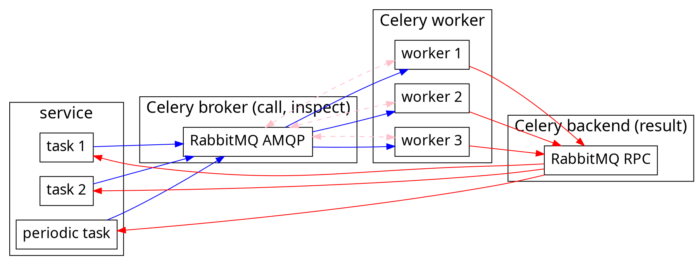

Celery meets Singleton
===

<!-- .slide: data-background-color="pink" -->
<!-- .slide: data-transition="zoom" -->

> [name=郭學聰 Hsueh-Tsung Kuo]
> [time=Sun, 06 Sep 2020] [color=red]

###### CC BY-SA 4.0

---

<!-- .slide: data-transition="convex" -->

## Who am I?


<small>Someone (who?) said:
a game programmer should be able to draw cute anime character(?)</small>

----

<!-- .slide: data-transition="convex" -->

* A programmer from game company in Taiwan
* Backend (and temporary frontend) engineer, focus on common service
* Usually develop something related to my work in Python, Ruby, ECMAScript, Golang, C#
* ECMAScript hater since **Netscape** is dead

----

<!-- .slide: data-transition="convex" -->

* Built CDN-aware game asset update system
* Built almost entire VOEZ game server by myself only
* Supported Sdorica backend development
* Verify and tweak Soul of Eden backend performance

---

<!-- .slide: data-transition="convex" -->

## Outline

----

<!-- .slide: data-transition="convex" -->

4. Celery
5. Singleton Task
    * Situations
    * Cases
6. Current Implementation
    * Principle
    * Local Mutex
    * Traditional Database
    * Redis &amp; Google Cloud Memory Store

----

<!-- .slide: data-transition="convex" -->

7. Alternative Implementation
    * Repository
    * Inspect
    * Task Collective Suicide
    * Demo
8. Conclusion
9. Reference
10. Q&A

---

<!-- .slide: data-transition="convex" -->

## Celery

----

<!-- .slide: data-transition="convex" -->

### What is Celery

https://docs.celeryproject.org/en/stable/

----

<!-- .slide: data-transition="convex" -->

### Structure



----

<!-- .slide: data-transition="convex" -->

### Usage

```python=
@app.task
def my_task(arg1, arg2, kwarg1='a', kwarg2='b'):
    ...
    return result
    
result = my_task.delay(arg1, arg2, kwarg1='x', kwarg2='y')
result = my_task.apply_async(args=[arg1, arg2],
    kwargs={'kwarg1': 'x', 'kwarg2': 'y'},
    countdown=60, expires=120)

result.get()
```

---

<!-- .slide: data-transition="convex" -->

## Singleton Task

----

<!-- .slide: data-transition="convex" -->

### Situations

* Only one task can be running at any given time
  * Launch only one worker
    * *Pile tasks up*
* Only one task can be **queued** at any given time
  * Skip running task which is queued later

----

<!-- .slide: data-transition="convex" -->

### Cases

* Garbage collect any resource
  * Clear blobs on S3/GCS
* Schedule background updating task
  * Update all user data everyday

---

<!-- .slide: data-transition="convex" -->

## Current Implementation

----

<!-- .slide: data-transition="convex" -->

### Principle #1

* Sender checks existence of same task 
* If there is no same task queued or running
  * Send task to queue

----

<!-- .slide: data-transition="convex" -->

### Principle #2

* Worker accepts task
* If any same task is already running
  * Skip task and quit execution
    * **Need at least two workers to flush out tasks**

----

<!-- .slide: data-transition="convex" -->

### Local Mutex

* Try to lock mutex
* Use mutex locking to identify if task is running

----

<!-- .slide: data-transition="convex" -->

### Traditional Database

* Try to write semaphore into database
* Check database to identify if task is running

----

<!-- .slide: data-transition="convex" -->

### Redis &amp; Google Cloud Memory Store

* Try to write a lock into Redis
  * Use SETNX
* Check Redis lock to identify if task is running
  * Identify return value of SETNX

----

<!-- .slide: data-transition="convex" -->

#### Redis Based Example

Celery-Singleton
https://github.com/steinitzu/celery-singleton

----

<!-- .slide: data-transition="convex" -->

#### Redis Based Feature

* Efficient
* Responsive
* No one will unlock Redis lock if worker is panic
  * Set lock TTL
    * Cannot estimate reasonable TTL when task duration is very unstable

---

<!-- .slide: data-transition="convex" -->

## Another Implementation

----

<!-- .slide: data-transition="convex" -->

### Repository

# CCS

----

<!-- .slide: data-transition="convex" -->

#### ~~CCS~~

~~Card Captor Sakura~~


----

<!-- .slide: data-transition="convex" -->

#### CCS

Celery-controlled singleton
https://github.com/fieliapm/celery_controlled_singleton

----

<!-- .slide: data-transition="convex" -->

### Inspect

* If any same task is already running (active)
  * Skip task and quit execution

----

<!-- .slide: data-transition="convex" -->

#### Idea

:bulb:

```python=
i = celery_app.control.inspect(timeout=1.0) # collect response after 1.0 second
i.active() # get active tasks
# then find same tasks in active tasks
```

----

<!-- .slide: data-transition="convex" -->

#### Detail

<style>
code.blue {
  color: #337AB7 !important;
}
code.orange {
  color: #F7A004 !important;
}
</style>

* <code class="orange">inspect.active()</code>: running tasks
* <code class="blue">inspect.reserved()</code>: queued tasks
* <code class="blue">inspect.scheduled()</code>: scheduled ETA tasks

:warning: You cannot atomically inspect all of them

----

<!-- .slide: data-transition="convex" -->

#### Feature

* Broker/backend independent
  * Based on any broker/backend such as AMQP/RPC :100:
  * Don't need Redis lock
    * Don't need to argue with SRE :tada:
* Inspect is slow
  * Affected by **timeout** parameter <!-- .element: class="fragment" data-fragment-index="1" -->
    * Short timeout causes inspect result missing <!-- .element: class="fragment" data-fragment-index="2" -->
  * Are delayed tasks really urgent? <!-- .element: class="fragment" data-fragment-index="3" -->

----

<!-- .slide: data-transition="convex" -->

#### Race Condition

# Task Collective Suicide

----

<!-- .slide: data-transition="convex" -->

### Task Collective Suicide

----

<!-- .slide: data-transition="convex" -->

#### Reason

* Task 1 and task 2 have same function &amp; parameter
* Worker 1 accepts task 1
* Worker 2 accepts task 2
  * They started simultaneously
* Worker 1 inspects and found task 2
* Worker 2 inspects and found task 1
* Worker 1 skips task 1 and quit
* Worker 2 skips task 2 and quit
  * No worker finishes the singleton task

----

<!-- .slide: data-transition="convex" -->

#### Solution

* Absolute time_start
  * Since v4.2.0rc1
  * Find same tasks with the earliest time_start

----

<!-- .slide: data-transition="convex" -->

#### Trap

* Multiple worker instances
  * No truly absolute time_start
      * Race hazard happens

----

<!-- .slide: data-transition="convex" -->

##### Reason

* Current standard time is 12:00:01
* Worker 1 accepts task 1 at 12:00:03 (12:00:01)
* Worker 1 inspects :arrow_right: task 1 is first task
* Worker 2 accepts task 2 at 12:00:00 (12:00:02)
* Worker 2 inspects :arrow_right: task 2 is first task
  * Because task 2 has earlier time_start
* Worker 1 runs task 1
* Worker 2 runs task 2
  * Two same tasks are running

----

<!-- .slide: data-transition="convex" -->

##### Reason (Alternative)

* Worker 1 accepts task 1
* Worker 2 accepts task 2
* Worker 2 reports task 2 active to broker
* Worker 2 inspects :arrow_right: task 2 is first task
* Worker 1 reports task 1 active to broker (lag)
* Worker 1 inspects :arrow_right: task 1 is first task
* Worker 1 runs task 1
* Worker 2 runs task 2
  * Two same tasks are running

----

<!-- .slide: data-transition="convex" -->

#### Mitigate Race Condition

* Delay before inspection
  * To ensure all same tasks listed in active list

----

<!-- .slide: data-transition="convex" -->

### Demo

Celery-controlled singleton
https://github.com/fieliapm/celery_controlled_singleton

---

<!-- .slide: data-transition="convex" -->

## Conclusion

----

<!-- .slide: data-transition="convex" -->

### Contribute!

* fieliapm/celery_controlled_singleton
  * Better implementation
    * No race condition

> [name=郭學聰 Hsueh-Tsung Kuo] [time=2020_09_06] [color=red] :notebook:

---

<!-- .slide: data-transition="convex" -->

## Reference

----

<!-- .slide: data-transition="convex" -->

### Link

* celery
  * https://docs.celeryproject.org/en/stable/
* how to implement single task:
  * <small>https://stackoverflow.com/questions/20894771/celery-beat-limit-to-single-task-instance-at-a-time</small>
* another possibility:
  * <small>https://stackoverflow.com/questions/20091505/celery-task-with-a-time-start-attribute-in-1970/20096342</small>
  * https://github.com/celery/celery/pull/3684
<small><small>https://github.com/celery/celery/blob/c0e587e94575d7be9bfdabe40c1d5dfda268e68e/celery/worker/request.py#L432</small></small>

---

<!-- .slide: data-transition="zoom" -->

## Q&A

---

<style>
.reveal {
    background: #FFDFEF;
    color: black;
}
.reveal h2,
.reveal h3,
.reveal h4,
.reveal h5,
.reveal h6 {
    color: black;
}
.reveal code {
    font-size: 18px !important;
    line-height: 1.2;
}

.progress div{
height:14px !important;
background: hotpink !important;
}

// original template

.rightpart{
    float:right;
    width:50%;
}

.leftpart{
    margin-right: 50% !important;
    height:50%;
}
.reveal section img { background:none; border:none; box-shadow:none; }
p.blo {
	font-size: 50px !important;
	background:#B6BDBB;
	border:1px solid silver;
	display:inline-block;
	padding:0.5em 0.75em;
	border-radius: 10px;
	box-shadow: 5px 5px 5px #666;
}

p.blo1 {
	background: #c7c2bb;
}
p.blo2 {
	background: #b8c0c8;
}
p.blo3 {
	background: #c7cedd;
}

p.bloT {
	font-size: 60px !important;
	background:#B6BDD3;
	border:1px solid silver;
	display:inline-block;
	padding:0.5em 0.75em;
	border-radius: 8px;
	box-shadow: 1px 2px 5px #333;
}
p.bloA {
	background: #B6BDE3;
}
p.bloB {
	background: #E3BDB3;
}

/*.slide-number{
	margin-bottom:10px !important;
	width:100%;
	text-align:center;
	font-size:25px !important;
	background-color:transparent !important;
}*/
iframe.myclass{
	width:100px;
	height:100px;
	bottom:0;
	left:0;
	position:fixed;
	border:none;
	z-index:99999;
}
h1.raw {
	color: #fff;
	background-image: linear-gradient(90deg,#f35626,#feab3a);
	-webkit-background-clip: text;
	-webkit-text-fill-color: transparent;
	animation: hue 5s infinite linear;
}
@keyframes hue {
	from {
	  filter: hue-rotate(0deg);
	}
	to {
	  filter: hue-rotate(360deg);
	}
}
.progress{
height:14px !important;
}

.progress span{
height:14px !important;
background: url("data:image/png;base64,iVBORw0KGgoAAAANSUhEUgAAAAEAAAAMCAIAAAAs6UAAAAAAGXRFWHRTb2Z0d2FyZQBBZG9iZSBJbWFnZVJlYWR5ccllPAAAAyJpVFh0WE1MOmNvbS5hZG9iZS54bXAAAAAAADw/eHBhY2tldCBiZWdpbj0i77u/IiBpZD0iVzVNME1wQ2VoaUh6cmVTek5UY3prYzlkIj8+IDx4OnhtcG1ldGEgeG1sbnM6eD0iYWRvYmU6bnM6bWV0YS8iIHg6eG1wdGs9IkFkb2JlIFhNUCBDb3JlIDUuMy1jMDExIDY2LjE0NTY2MSwgMjAxMi8wMi8wNi0xNDo1NjoyNyAgICAgICAgIj4gPHJkZjpSREYgeG1sbnM6cmRmPSJodHRwOi8vd3d3LnczLm9yZy8xOTk5LzAyLzIyLXJkZi1zeW50YXgtbnMjIj4gPHJkZjpEZXNjcmlwdGlvbiByZGY6YWJvdXQ9IiIgeG1sbnM6eG1wPSJodHRwOi8vbnMuYWRvYmUuY29tL3hhcC8xLjAvIiB4bWxuczp4bXBNTT0iaHR0cDovL25zLmFkb2JlLmNvbS94YXAvMS4wL21tLyIgeG1sbnM6c3RSZWY9Imh0dHA6Ly9ucy5hZG9iZS5jb20veGFwLzEuMC9zVHlwZS9SZXNvdXJjZVJlZiMiIHhtcDpDcmVhdG9yVG9vbD0iQWRvYmUgUGhvdG9zaG9wIENTNiAoV2luZG93cykiIHhtcE1NOkluc3RhbmNlSUQ9InhtcC5paWQ6QUNCQzIyREQ0QjdEMTFFMzlEMDM4Qzc3MEY0NzdGMDgiIHhtcE1NOkRvY3VtZW50SUQ9InhtcC5kaWQ6QUNCQzIyREU0QjdEMTFFMzlEMDM4Qzc3MEY0NzdGMDgiPiA8eG1wTU06RGVyaXZlZEZyb20gc3RSZWY6aW5zdGFuY2VJRD0ieG1wLmlpZDpBQ0JDMjJEQjRCN0QxMUUzOUQwMzhDNzcwRjQ3N0YwOCIgc3RSZWY6ZG9jdW1lbnRJRD0ieG1wLmRpZDpBQ0JDMjJEQzRCN0QxMUUzOUQwMzhDNzcwRjQ3N0YwOCIvPiA8L3JkZjpEZXNjcmlwdGlvbj4gPC9yZGY6UkRGPiA8L3g6eG1wbWV0YT4gPD94cGFja2V0IGVuZD0iciI/PovDFgYAAAAmSURBVHjaYvjPwMAAxjMZmBhA9H8INv4P4TPM/A+m04zBNECAAQBCWQv9SUQpVgAAAABJRU5ErkJggg==") repeat-x !important;

}

.progress span:after,
.progress span.nyancat{
	content: "";
	background: url('data:image/gif;base64,R0lGODlhIgAVAKIHAL3/9/+Zmf8zmf/MmZmZmf+Z/wAAAAAAACH/C05FVFNDQVBFMi4wAwEAAAAh/wtYTVAgRGF0YVhNUDw/eHBhY2tldCBiZWdpbj0i77u/IiBpZD0iVzVNME1wQ2VoaUh6cmVTek5UY3prYzlkIj8+IDx4OnhtcG1ldGEgeG1sbnM6eD0iYWRvYmU6bnM6bWV0YS8iIHg6eG1wdGs9IkFkb2JlIFhNUCBDb3JlIDUuMy1jMDExIDY2LjE0NTY2MSwgMjAxMi8wMi8wNi0xNDo1NjoyNyAgICAgICAgIj4gPHJkZjpSREYgeG1sbnM6cmRmPSJodHRwOi8vd3d3LnczLm9yZy8xOTk5LzAyLzIyLXJkZi1zeW50YXgtbnMjIj4gPHJkZjpEZXNjcmlwdGlvbiByZGY6YWJvdXQ9IiIgeG1sbnM6eG1wTU09Imh0dHA6Ly9ucy5hZG9iZS5jb20veGFwLzEuMC9tbS8iIHhtbG5zOnN0UmVmPSJodHRwOi8vbnMuYWRvYmUuY29tL3hhcC8xLjAvc1R5cGUvUmVzb3VyY2VSZWYjIiB4bWxuczp4bXA9Imh0dHA6Ly9ucy5hZG9iZS5jb20veGFwLzEuMC8iIHhtcE1NOk9yaWdpbmFsRG9jdW1lbnRJRD0ieG1wLmRpZDpDMkJBNjY5RTU1NEJFMzExOUM4QUM2MDAwNDQzRERBQyIgeG1wTU06RG9jdW1lbnRJRD0ieG1wLmRpZDpCREIzOEIzMzRCN0IxMUUzODhEQjgwOTYzMTgyNTE0QiIgeG1wTU06SW5zdGFuY2VJRD0ieG1wLmlpZDpCREIzOEIzMjRCN0IxMUUzODhEQjgwOTYzMTgyNTE0QiIgeG1wOkNyZWF0b3JUb29sPSJBZG9iZSBQaG90b3Nob3AgQ1M2IChXaW5kb3dzKSI+IDx4bXBNTTpEZXJpdmVkRnJvbSBzdFJlZjppbnN0YW5jZUlEPSJ4bXAuaWlkOkM1QkE2NjlFNTU0QkUzMTE5QzhBQzYwMDA0NDNEREFDIiBzdFJlZjpkb2N1bWVudElEPSJ4bXAuZGlkOkMyQkE2NjlFNTU0QkUzMTE5QzhBQzYwMDA0NDNEREFDIi8+IDwvcmRmOkRlc2NyaXB0aW9uPiA8L3JkZjpSREY+IDwveDp4bXBtZXRhPiA8P3hwYWNrZXQgZW5kPSJyIj8+Af/+/fz7+vn49/b19PPy8fDv7u3s6+rp6Ofm5eTj4uHg397d3Nva2djX1tXU09LR0M/OzczLysnIx8bFxMPCwcC/vr28u7q5uLe2tbSzsrGwr66trKuqqainpqWko6KhoJ+enZybmpmYl5aVlJOSkZCPjo2Mi4qJiIeGhYSDgoGAf359fHt6eXh3dnV0c3JxcG9ubWxramloZ2ZlZGNiYWBfXl1cW1pZWFdWVVRTUlFQT05NTEtKSUhHRkVEQ0JBQD8+PTw7Ojk4NzY1NDMyMTAvLi0sKyopKCcmJSQjIiEgHx4dHBsaGRgXFhUUExIREA8ODQwLCgkIBwYFBAMCAQAAIfkECQcABwAsAAAAACIAFQAAA6J4umv+MDpG6zEj682zsRaWFWRpltoHMuJZCCRseis7xG5eDGp93bqCA7f7TFaYoIFAMMwczB5EkTzJllEUttmIGoG5bfPBjDawD7CsJC67uWcv2CRov929C/q2ZpcBbYBmLGk6W1BRY4MUDnMvJEsBAXdlknk2fCeRk2iJliAijpBlEmigjR0plKSgpKWvEUheF4tUZqZID1RHjEe8PsDBBwkAIfkECQcABwAsAAAAACIAFQAAA6B4umv+MDpG6zEj682zsRaWFWRpltoHMuJZCCRseis7xG5eDGp93TqS40XiKSYgTLBgIBAMqE/zmQSaZEzns+jQ9pC/5dQJ0VIv5KMVWxqb36opxHrNvu9ptPfGbmsBbgSAeRdydCdjXWRPchQPh1hNAQF4TpM9NnwukpRyi5chGjqJEoSOIh0plaYsZBKvsCuNjY5ptElgDyFIuj6+vwcJACH5BAkHAAcALAAAAAAiABUAAAOfeLrc/vCZSaudUY7Nu99GxhhcYZ7oyYXiQQ5pIZgzCrYuLMd8MbAiUu802flYGIhwaCAQDKpQ86nUoWqF6dP00wIby572SXE6vyMrlmhuu9GKifWaddvNQAtszXYCxgR/Zy5jYTFeXmSDiIZGdQEBd06QSBQ5e4cEkE9nnZQaG2J4F4MSLx8rkqUSZBeurhlTUqsLsi60DpZxSWBJugcJACH5BAkHAAcALAAAAAAiABUAAAOgeLrc/vCZSaudUY7Nu99GxhhcYZ7oyYXiQQ5pIZgzCrYuLMd8MbAiUu802flYGIhwaCAQDKpQ86nUoWqF6dP00wIby572SXE6vyMrlmhuu9GuifWaddvNwMkZtmY7AWMEgGcKY2ExXl5khFMVc0Z1AQF3TpJShDl8iASST2efloV5JTyJFpgOch8dgW9KZxexshGNLqgLtbW0SXFwvaJfCQAh+QQJBwAHACwAAAAAIgAVAAADoXi63P7wmUmrnVGOzbvfRsYYXGGe6MmF4kEOaSGYMwq2LizHfDGwIlLPNKGZfi6gZmggEAy2iVPZEKZqzakq+1xUFFYe90lxTsHmim6HGpvf3eR7skYJ3PC5tyystc0AboFnVXQ9XFJTZIQOYUYFTQEBeWaSVF4bbCeRk1meBJYSL3WbaReMIxQfHXh6jaYXsbEQni6oaF21ERR7l0ksvA0JACH5BAkHAAcALAAAAAAiABUAAAOeeLrc/vCZSaudUY7Nu99GxhhcYZ7oyYXiQQ5pIZgzCrYuLMfFlA4hTITEMxkIBMOuADwmhzqeM6mashTCXKw2TVKQyKuTRSx2wegnNkyJ1ozpOFiMLqcEU8BZHx6NYW8nVlZefQ1tZgQBAXJIi1eHUTRwi0lhl48QL0sogxaGDhMlUo2gh14fHhcVmnOrrxNqrU9joX21Q0IUElm7DQkAIfkECQcABwAsAAAAACIAFQAAA6J4umv+MDpG6zEj682zsRaWFWRpltoHMuJZCCRseis7xG5eDGp93bqCA7f7TFaYoIFAMMwczB5EkTzJllEUttmIGoG5bfPBjDawD7CsJC67uWcv2CRov929C/q2ZpcBbYBmLGk6W1BRY4MUDnMvJEsBAXdlknk2fCeRk2iJliAijpBlEmigjR0plKSgpKWvEUheF4tUZqZID1RHjEe8PsDBBwkAIfkECQcABwAsAAAAACIAFQAAA6B4umv+MDpG6zEj682zsRaWFWRpltoHMuJZCCRseis7xG5eDGp93TqS40XiKSYgTLBgIBAMqE/zmQSaZEzns+jQ9pC/5dQJ0VIv5KMVWxqb36opxHrNvu9ptPfGbmsBbgSAeRdydCdjXWRPchQPh1hNAQF4TpM9NnwukpRyi5chGjqJEoSOIh0plaYsZBKvsCuNjY5ptElgDyFIuj6+vwcJACH5BAkHAAcALAAAAAAiABUAAAOfeLrc/vCZSaudUY7Nu99GxhhcYZ7oyYXiQQ5pIZgzCrYuLMd8MbAiUu802flYGIhwaCAQDKpQ86nUoWqF6dP00wIby572SXE6vyMrlmhuu9GKifWaddvNQAtszXYCxgR/Zy5jYTFeXmSDiIZGdQEBd06QSBQ5e4cEkE9nnZQaG2J4F4MSLx8rkqUSZBeurhlTUqsLsi60DpZxSWBJugcJACH5BAkHAAcALAAAAAAiABUAAAOgeLrc/vCZSaudUY7Nu99GxhhcYZ7oyYXiQQ5pIZgzCrYuLMd8MbAiUu802flYGIhwaCAQDKpQ86nUoWqF6dP00wIby572SXE6vyMrlmhuu9GuifWaddvNwMkZtmY7AWMEgGcKY2ExXl5khFMVc0Z1AQF3TpJShDl8iASST2efloV5JTyJFpgOch8dgW9KZxexshGNLqgLtbW0SXFwvaJfCQAh+QQJBwAHACwAAAAAIgAVAAADoXi63P7wmUmrnVGOzbvfRsYYXGGe6MmF4kEOaSGYMwq2LizHfDGwIlLPNKGZfi6gZmggEAy2iVPZEKZqzakq+1xUFFYe90lxTsHmim6HGpvf3eR7skYJ3PC5tyystc0AboFnVXQ9XFJTZIQOYUYFTQEBeWaSVF4bbCeRk1meBJYSL3WbaReMIxQfHXh6jaYXsbEQni6oaF21ERR7l0ksvA0JACH5BAkHAAcALAAAAAAiABUAAAOeeLrc/vCZSaudUY7Nu99GxhhcYZ7oyYXiQQ5pIZgzCrYuLMfFlA4hTITEMxkIBMOuADwmhzqeM6mashTCXKw2TVKQyKuTRSx2wegnNkyJ1ozpOFiMLqcEU8BZHx6NYW8nVlZefQ1tZgQBAXJIi1eHUTRwi0lhl48QL0sogxaGDhMlUo2gh14fHhcVmnOrrxNqrU9joX21Q0IUElm7DQkAOw==') !important;
   width: 34px !important;
   height: 21px !important;
   border: none !important;
   float:right;
   margin-top:-7px;
   margin-right:-10px;
}
</style>

